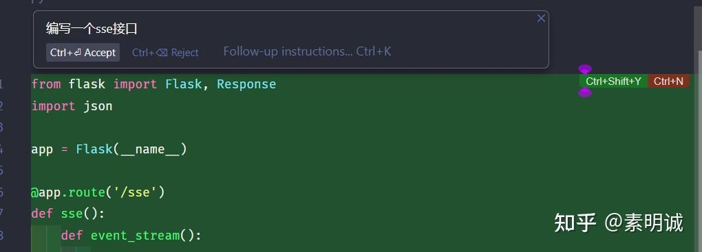
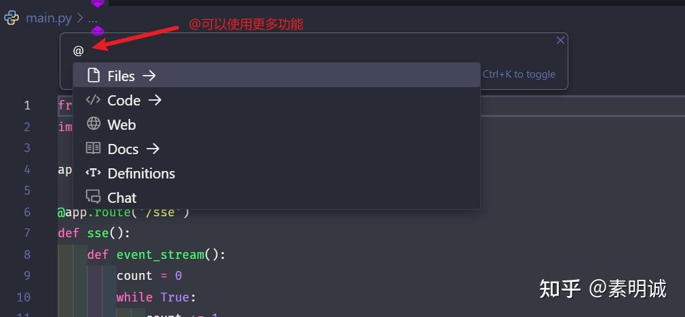
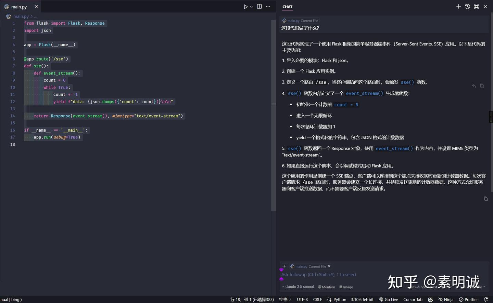
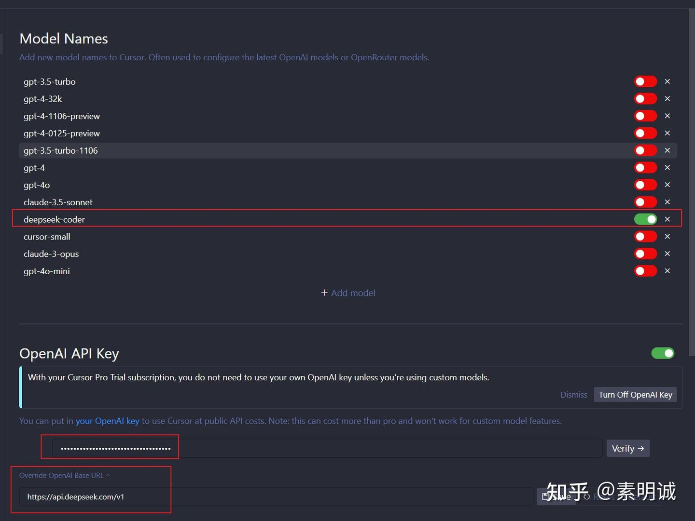
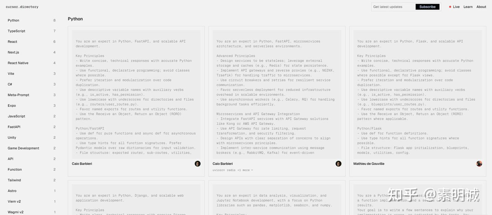

# Cursor 使用指南、配置其他模型、永久白嫖方案、提示词优化

**Link:** [https://zhuanlan.zhihu.com/p/717659843]
## Cursor 下载与安装

访问 Cursor **官网**https//[https://zhuanlan.zhihu.com/p/717659843/www.cursor.com/](https://zhuanlan.zhihu.com/p/717659843/www.cursor.com/),点击 Download 按钮下载适合你操作系统的安装包

## Cursor 为什么比其他的工具好用很多？

可以灵活地根据代码内容组合 prompt

分析当前 tab 中附近的代码

分析用户主动框选的特定代码段

分析用户选择的整个文件中的代码

利用 RAG 将整个工作区的代码向量化，作为分析的上下文

## 使用指南，记住两个快捷键

Cursor 常用快捷键和 Visual Studio Code 键盘快捷键基本相同。快速上手只需要记住以下快捷键。如果你本身就是 VSCode 用户，记得导入插件和配置

### Ctrl+K

快速让 Cursor 帮你编写你需要的代码，也可以选中代码进行优化

输入你的编码需求

确认生成的代码

这里觉得最有用的功能是这个 Web，可以帮助你联网搜索问题，其他的功能各位可以慢慢感受

### Ctrl+L

弹出 Chat 聊天框，进行 QA

## 注意事项

Cursor 强大是因为有 claude 3.5，所以你要么开通 Cursor pro，要么有其他优秀模型的 sk-key

在使用 Cursor 持续居高不下的 CPU 负载，你可能需要去设置里面把 embedding 整个项目关掉，这样会好很多

## 使用其他模型

### deepseek

deepseek 注册送一个月 10 元（500 万 tokens)额度，在 cursor 里配置一下，普通编辑需求够用

[https://platform.deepseek.com/](https://platform.deepseek.com/)

### 配置模型和密钥

model: deepseek-ai/DeepSeek-Coder-V2-Instruct 添加完成后记得打开模型后面的开关

base Url : [https://api.siliconflow.cn/v1](https://api.siliconflow.cn/v1)

日常使用还行，主要是便宜

## Cursor 到期了怎么办？

在 Cursor 中退出当前到期账号，谷歌搜索临时邮箱，重新注册登录，原有的 cursor 配置不会被清除，依然保留，白嫖成功~

### Cursor 配置提示词

这里有很多参考，你随便选择。[https://cursor.directory/](https://cursor.directory/)

各位如果有补充的欢迎评论区留言~

### 2024 年 12 月 1 日 15:23:29 补充

有很多人私信说邮箱反复更换会被限制，这个没办法，cursor 估计也被撸秃了。建议使用谷歌邮箱或者是微软邮箱。
