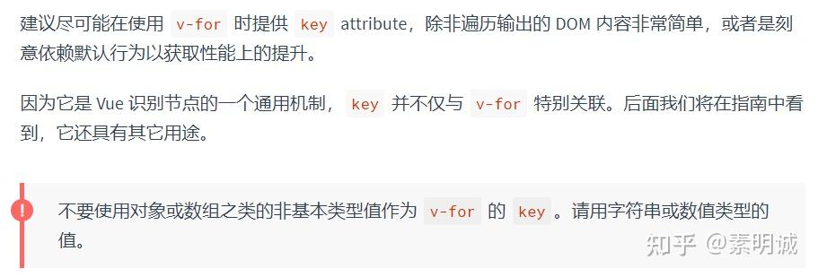

# v-for 为什么不推荐用 index 做 key

 **Link:** [https://zhuanlan.zhihu.com/p/604412468]

在Vue文档列表渲染中，明确提到一句话

这里提到了除非可以依赖默认行为以获取性能上的提升，除了这种情况以外是一定要使用 key 的。

## key的作用  

在 Vue 中更新视图的时候我们需要通过 diff 算法对新旧 DOM 进行比较差异，重新渲染。key 在这里起到的作用就是一个唯一标识，为了更高效的对比虚拟 DOM 中每个节点是否相同。

## 就地更新策略  

Vue 采用“就地更新”的策略来更新DOM，当数据项的顺序发生改变，Vue不会随之移动DOM元素的顺序，而是就地更新每个元素。

为什么要采用这种方式？

因为这种方式是高效的，尤其是在用于列表渲染的时候，Vue会尽可能复用相同元素。如果使用 index 有时候会导致渲染异常或者错位的现象。

所以，尽可能使用 key 并保障 key 是唯一的，如果没有唯一值可以使用 nanoId等其他的库来生成 key