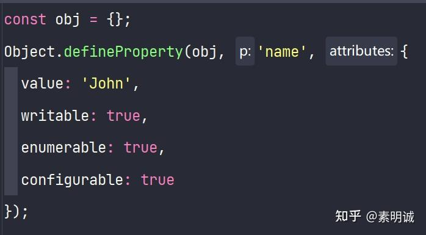
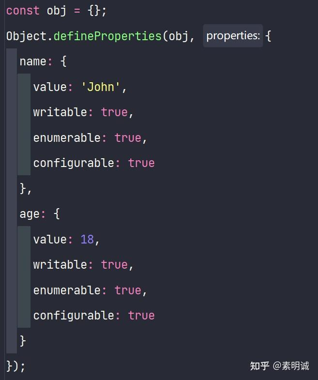

# Object.defineProperty()和Object.defineProperties()的区别

 **Link:** [https://zhuanlan.zhihu.com/p/608175510]

`Object.defineProperty()`和`Object.defineProperties()`都是用于定义对象属性的方法，不同之处在于它们的作用范围不同。

`Object.defineProperty()`用于定义单个对象属性，它接收三个参数：对象、属性名、属性描述符，例如：

`Object.defineProperties()`则可以用于定义多个对象属性，它接收两个参数：对象和一个属性描述符对象（该对象的属性名对应要定义的属性名），例如：

因此，如果只需要定义单个对象属性，使用`Object.defineProperty()`即可；如果需要定义多个对象属性，使用`Object.defineProperties()`更为方便。

