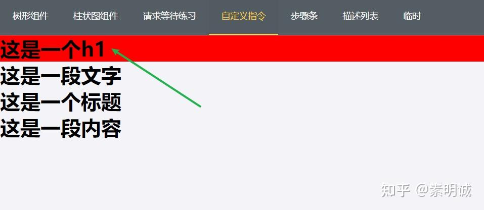

# Vue 自定义指令的使用

我们可以通过 `Vue.directive` 方法来自定义指令。该方法接受两个参数，第一个参数是指令名称，第二个参数是一个对象，包含了指令的定义。

## 定义一个背景变红的指令

```
Vue.directive('bgColor', {
  bind(el, binding) {
    el.style.backgroundColor = binding.value
  }
})

```

HTML

```
    <h1 v-bgColor="'red'">这是一个h1</h1>
    <h1>这是一段文字</h1>
    <h1>这是一个标题</h1>
    <h1>这是一段内容</h1>
```



当我们自定义一个指令时，可以定义一些钩子函数，这些钩子函数会在指令绑定到元素上、元素更新、元素插入到文档流中、元素更新并且包含组件的 VNode 更新等生命周期中触发。以下是这些钩子函数的详细说明：

`bind`: 只调用一次，在指令第一次绑定到元素时调用。在这里可以进行一些初始化设置，例如添加事件监听器，设置元素样式等。`bind`函数接收四个参数：`el`表示绑定指令的元素，`binding`表示指令相关信息的对象，`vnode`表示渲染指令的 VNode 节点，`oldVnode`表示上一个渲染指令的 VNode 节点。

`inserted`: 在被绑定元素插入到父元素中时调用，只调用一次。此时可以进行一些 DOM 操作，例如获取元素的宽高、定位等。`inserted`函数接收和`bind`一样的参数。

`update`: 在指令所在元素的 VNode 更新时调用，但是可能发生在其子 VNode 更新之前。所以如果需要先处理子 VNode，应该在 `componentUpdated` 钩子中完成。`update`函数接收和`bind`一样的参数，可以通过比较 binding.value 和 binding.oldValue 的值来判断是否需要进行更新操作。

`componentUpdated`: 在指令所在的 VNode 及其子 VNode 全部更新后调用。`componentUpdated`函数接收和`bind`一样的参数。

`unbind`: 只调用一次，在指令被解绑时调用。可以在这里进行一些清理工作，例如移除事件监听器，清除定时器等。`unbind`函数接收两个参数：`el`表示解绑指令的元素，`binding`表示指令相关信息的对象。

## 自定义指令使用场景

1. 操作 DOM：例如修改样式、绑定事件等；
2. 封装插件：例如集成第三方插件，提供更便捷的调用方式；
3. 表单验证：例如自定义验证规则，便于表单验证代码的重用；
4. 优化性能：例如自定义指令实现图片懒加载等功能，可以提高页面性能。
5. 权限控制：控制某些显示或者隐藏
