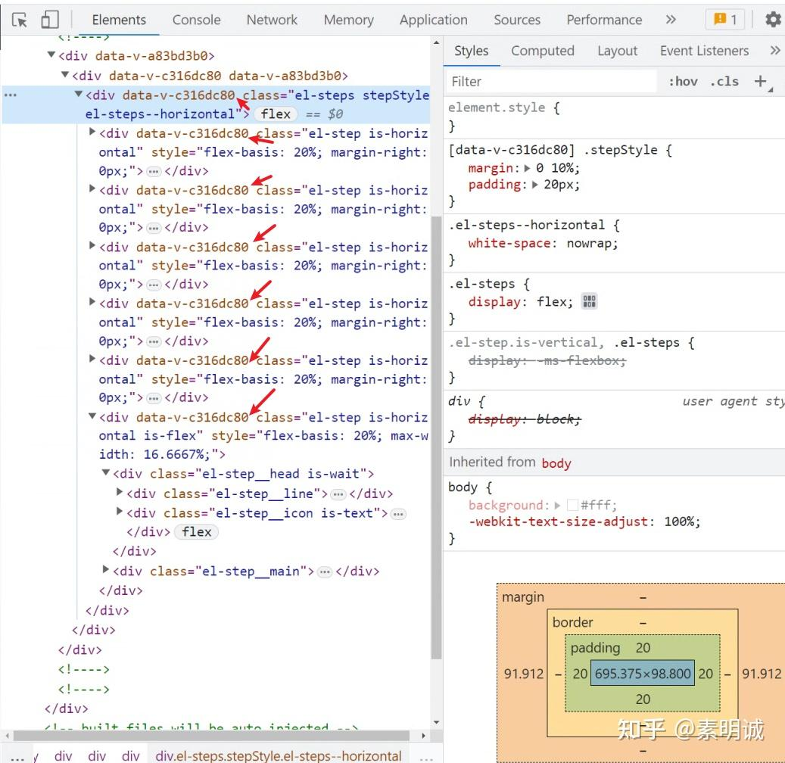

# vue scoped  的原理


 


Vue 中的 `scoped` 属性可以将样式作用域限制在当前组件的范围内，避免全局污染。其实现原理是通过给当前组件的所有选择器加上一个唯一的标识符（如 `_v-xxxxxx`），从而让当前组件的样式仅对带有这个标识符的元素生效。

具体来说，当一个 Vue 组件中使用了 `scoped` 属性时，Vue 在编译组件时会通过 PostCSS 插件（如 postcss-selector-scope）将组件中的所有样式选择器添加一个特殊的属性选择器，以确保样式只作用于当前组件。例如，对于以下 Vue 组件中的样式：

```
<template>
  <div class="foo">
    <p class="bar">Hello, world!</p>
  </div>
</template>

<style scoped>
  .foo {
    background-color: blue;
  }
  .bar {
    color: red;
  }
</style> 
```

Vue 会将其编译成类似以下代码：

```
 <template>
  <div class="foo" data-v-xxxxxx>
    <p class="bar" data-v-xxxxxx>Hello, world!</p>
  </div>
</template>

<style>
  .foo[data-v-xxxxxx] {
    background-color: blue;
  }
  .bar[data-v-xxxxxx] {
    color: red;
  }
</style>
```


可以发现他们的 data-v-xxxx 是相同的

  
  

注意，Vue 会自动生成一个唯一的标识符（如 `_v-xxxxxx`）并将其添加到当前组件的所有选择器中，以确保样式仅作用于当前组件。而对于 HTML 元素的原有类名或 ID，在使用 `scoped` 属性时并不会添加标识符，因此样式规则仍然会被应用。