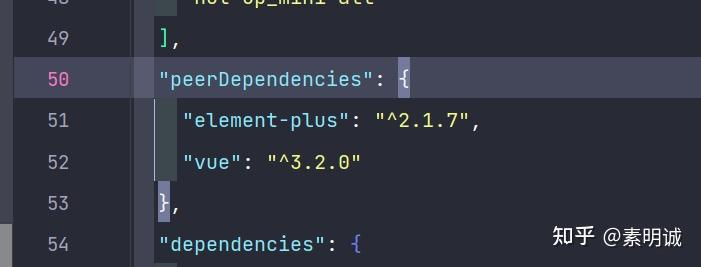

# 对等依赖（peer dependency）

对等依赖（peer dependency）指的是一个库需要在其工作环境中预先存在一个特定的库或者工具，但并不直接包含或导入这个特定库。这种特定库被称为这个库的对等依赖。

假设你正在开发一个名为 `my-plugin` 的 Vue.js 插件。这个插件需要在一个已经安装了 Vue.js 的环境中运行，因为它需要使用 Vue.js 的一些特性或 API。然而，`my-plugin` 并不会直接包含 Vue.js 的代码，它只是假设 Vue.js 已经存在于其运行环境中。在这种情况下，我们说 Vue.js 是 `my-plugin` 的对等依赖。

当你在 `my-plugin` 的 `package.json` 文件中声明 Vue.js 为对等依赖时，你在告诉使用 `my-plugin` 的开发者，他们需要自己手动安装 Vue.js。

对等依赖的一个主要应用场景是插件系统，如上面的例子。插件需要使用主程序（如 Vue.js）的 API，但并不直接包含主程序的代码。通过将主程序声明为对等依赖，插件可以确保自己总是使用与主程序相同的版本，避免版本冲突或者不兼容的问题。

另外，对等依赖也可以用于强制执行某些版本的兼容性。例如，如果 `my-plugin` 只能和 Vue.js 3.x 兼容，那么你可以在 `my-plugin` 的 `package.json` 文件中声明 Vue.js 的版本为 "^3.0.0"。这样，如果用户尝试在 Vue.js 2.x 的环境中使用 `my-plugin`，他们会收到一个警告。

**例如，你可以这样声明**

