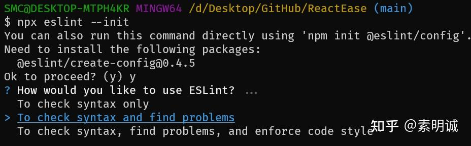
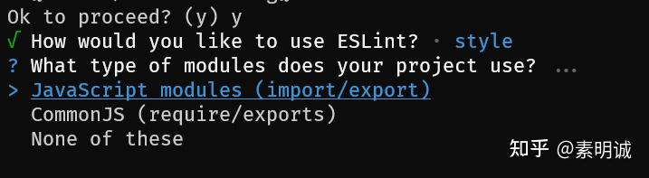
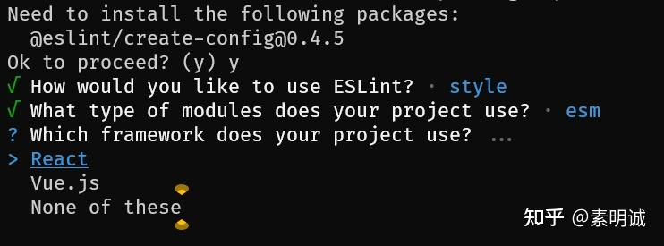
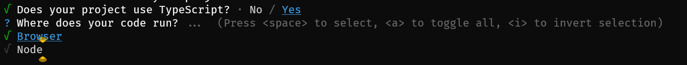
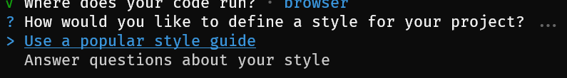
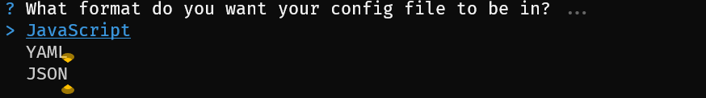
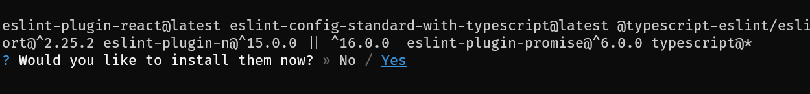
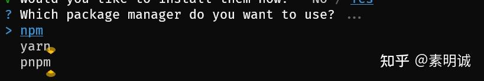
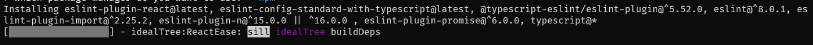
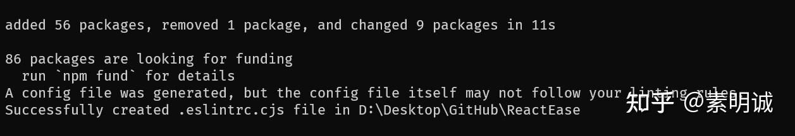

# ESLint 配置


 **Link:** [https://zhuanlan.zhihu.com/p/646202423]


初始化配置

```
npx eslint --init
```


eslint/create-config 是一个用于帮助创建和管理 ESLint 配置文件的工具包

  
  

* "To check syntax only"：只进行语法检查。
* "To check syntax and find problems"：进行语法检查，并找出可能的问题。
* "To check syntax, find problems, and enforce code style"：进行语法检查，找出可能的问题，并强制执行代码风格。

一般选择最后一个，毕竟安装就是为了找出代码问题

**继续下一项**



* "JavaScript modules (import/export)"：这意味着你的项目使用 ES6 模块化规范，也就是使用 `import` 和 `export` 关键字来导入和导出模块。
* "CommonJS (require/exports)"：这意味着你的项目使用 CommonJS 模块化规范，也就是使用 `require()` 和 `module.exports` 或者 `exports` 来导入和导出模块。
* "None of these"：如果你的项目不使用上述任何一种模块化规范，可以选择这个选项。

如果你是vite项目，建议选择第一项

**继续下一项**



选择框架

  
  

**继续下一项**



是否使用了TS

  
  

选择代码的运行环境，是node还是浏览器

**继续下一项**



* "Use a popular style guide"：使用一个流行的代码风格指南。如果你选择这个选项，ESLint 将会让你选择一个流行的代码风格指南（如 Airbnb，Standard，Google 等）作为你的代码风格规则。
* "Answer questions about your style"：回答关于你的代码风格的问题。如果你选择这个选项，ESLint 将会询问你一系列关于代码风格的问题（如你是否使用分号，你的缩进是两个空格还是四个空格等），并根据你的回答生成相应的代码风格规则。

一般选择一个流行的风格指南即可

**继续下一项**



* "JavaScript"：你的 ESLint 配置文件将是一个 JavaScript 文件，通常命名为 `.eslintrc.js`。JavaScript 格式的配置文件允许你使用 JavaScript 代码，例如你可以使用变量和函数，也可以导入其他模块。
* "YAML"：你的 ESLint 配置文件将是一个 YAML 文件，通常命名为 `.eslintrc.yaml`。YAML 格式的配置文件易于阅读和编写，但不能使用 JavaScript 代码。
* "JSON"：你的 ESLint 配置文件将是一个 JSON 文件，通常命名为 `.eslintrc.json`。JSON 格式的配置文件也易于阅读和编写，但同样不能使用 JavaScript 代码。

我一般选择第一个

**继续下一项**



* `eslint-plugin-react`：这个包提供了一些特定于 React 的 linting 规则。
* `eslint-config-standard-with-typescript`：这个包提供了一个集成了 Standard style 和 TypeScript 的 ESLint 配置。
* `@typescript-eslint/eslint-plugin`：这个包包含了一些针对 TypeScript 的 linting 规则。
* `eslint`：这是 ESLint 本身。
* `eslint-plugin-import`：这个包提供了一些关于 ES6 import/export 语法的 linting 规则。
* `eslint-plugin-node`：这个包提供了一些针对 Node.js 的 linting 规则。
* `eslint-plugin-promise`：这个包提供了一些关于 Promise 的 linting 规则。
* `typescript`：这是 TypeScript 本身。

yes

**继续下一项**



喜欢哪个安装哪个

  
  

**继续下一项**



开始安装了



结束

