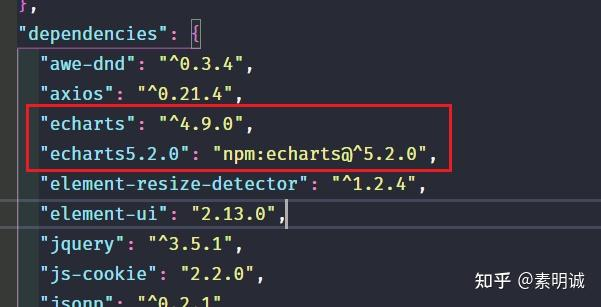

# ECharts版本升级指南：结合ECharts 4的地图与ECharts 5的新功能


 **Link:** [https://zhuanlan.zhihu.com/p/653053205]

## 问题  

1. 在`ECharts5`以上的版本不提供`china.js`，虽然我们可以从`github`上找到`china.js`这个文件，但你就不可以使用`ECharts5`的诸多新功能。
2. 那么怎么才能使用`ECharts4`提供的地图和`ECharts5`的新功能呢？

## 提示  

`ECharts4`的地图没有按照中国测量标准进行测量，如果在比较正式项目上使用可能会存在法律问题。你可以考虑自己修改或者去上网找修改优化后的版本。

## 解决4~5版本问题  

安装两个版本


```
import * as echarts5 from "echarts5.2.0";
import * as echarts4 from "echarts";

```
