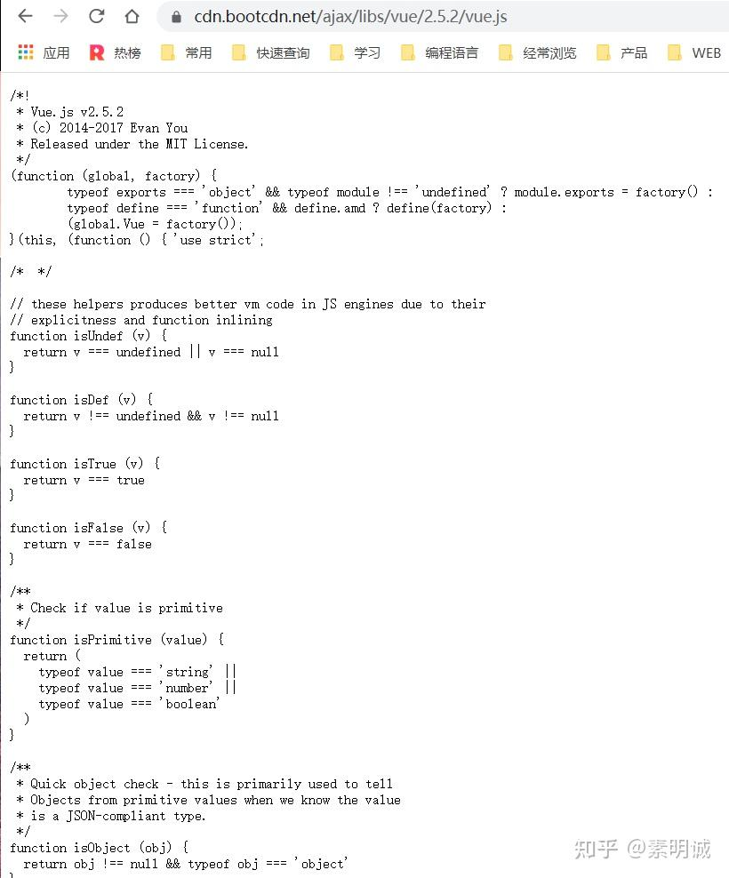
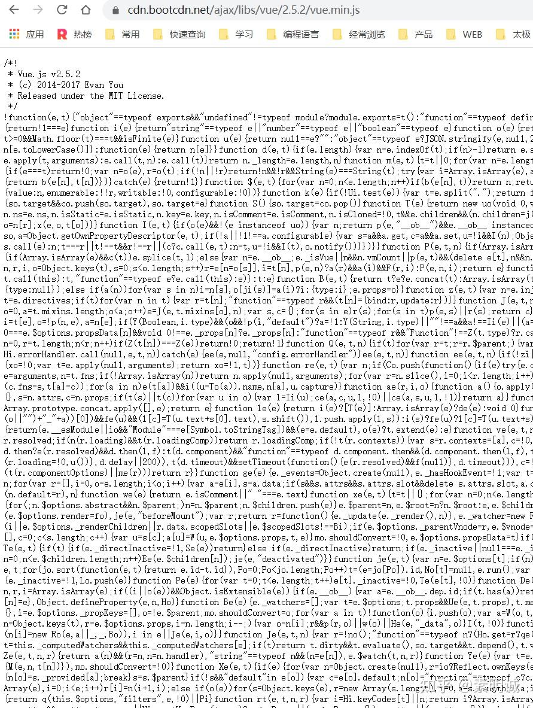

# Javascript 中 .min.js 和 .js 文件的区别

## .js 内容

## min.js 内容  

**JavaScript 文件：常规 vs 最小化**

在 Web 开发中，JavaScript 是一个不可或缺的元素。开发者在构建和部署应用程序时，经常会遇到两种类型的 JavaScript 文件：`.js` 和 `.min.js`。了解它们的区别和各自的优缺点是至关重要的。

### .js 文件

**优点**：

- 代码是原始的，未经过任何压缩处理，这使得开发者可以轻松地阅读、理解和修改代码内容。

**缺点**：

- 由于包含了所有格式化内容（如空格、缩进和注释），文件的体积相对较大，这导致其在网络上的加载和传输时间增加。

### .min.js 文件

**优点**：

- 体积较小，因此传输和加载速度更快，为用户提供了更快的响应时间。
- 由于代码混淆，一般人很难理解其内容，这为源代码提供了一定程度的保护，减少了被窃取的风险。

**缺点**：

- 代码的可读性差，这使得它在调试和修改时可能会遇到困难。

### JavaScript 文件压缩的原理

JavaScript 文件的压缩并不是一个简单的过程，它涉及多个步骤，以确保文件尽可能小，同时代码仍然能够正常运行。

1. **删除无用内容**：所有不必要的注释、空格、换行符和其他格式化内容都被移除，从而减小文件大小。
2. **代码混淆**：为了进一步减小文件大小并提供源代码的一定保护，变量和函数名被更改为短而没有实际意义的名称。此外，没有使用的代码、内联函数和等价语句也可能被删除或替换。

总之，选择使用 `.js` 还是 `.min.js` 文件取决于你的实际需求。在开发和调试过程中，使用常规 `.js` 文件更为合适。但在生产环境中，为了提供更快的加载速度和保护源代码，使用 `.min.js` 文件通常是更好的选择。
