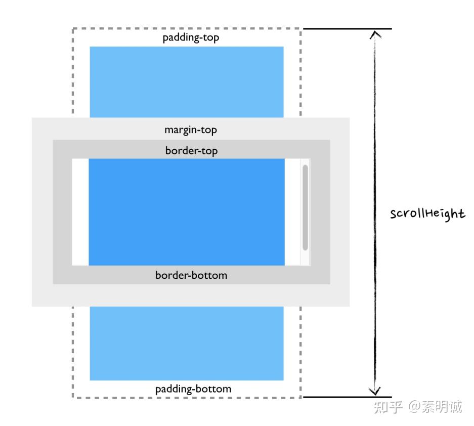
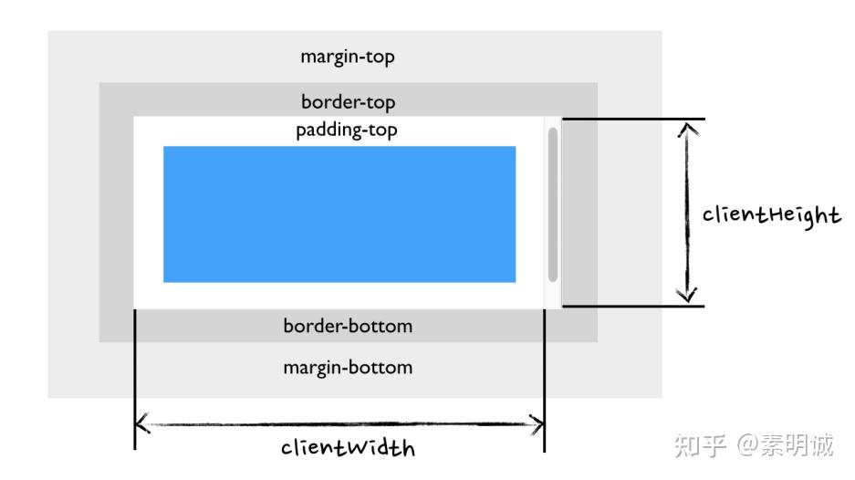

# 如何检测阅读用户阅读到底


 **Link:** [https://zhuanlan.zhihu.com/p/653051644]

## scrollHeight  
## scrollTop  

**属性可以获取或设置一个元素的内容垂直滚动的像素数**

一个元素的`scrollTop`值是这个元素的**内容顶部**（卷起来的）到它的视口可见内容（的顶部）的距离的度量。当一个元素的内容没有产生垂直方向的滚动条，那么它的`scrollTop`值为`0`。

**在使用显示比例缩放的系统上，`scrollTop`可能会提供一个小数。**

## clientHeight  
## 公式  
```
parseInt(scrollHeight) - parseInt(scrollTop) == parseInt(clientHeight);
```

使用`parseInt`可以保证在移动端上忽略小数部分的影响。

