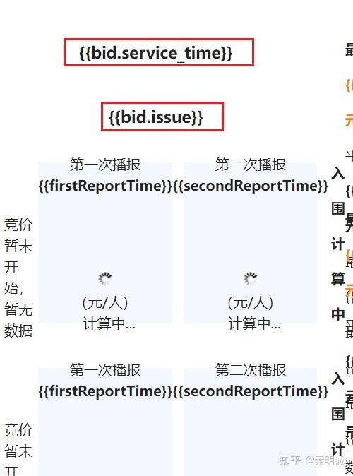

# 解决Vue页面使用插值表达式闪烁


 **Link:** [https://zhuanlan.zhihu.com/p/653053740]

## 描述  
## 方法1  

使用`Vue`自带的指令

注意，该指令不兼容`IE`，而且会导致`IE`白屏，建议使用方法`2`解决问题

```
    [v-cloak] {
      display: none;
    }
```
## 方法2  

使用`v-text`或者`v-html`来代替

```
<div class="report3" v-text="fPprice">{{fPprice}}</div>
```
