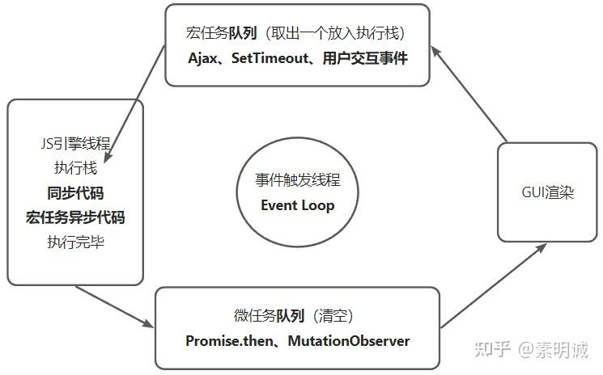

# JavaScript事件环，宏任务和微任务

 **Link:** [https://zhuanlan.zhihu.com/p/605667820]

JavaScript 是单线程语言，它在一个事件环中处理所有任务。事件环是一个循环，在每一轮中，JavaScript 引擎会处理所有排队的任务，包括计算、事件处理以及其他任务。

在 JavaScript 中，任务可以分为两种：宏任务和微任务。

宏任务指的是任务队列中的主任务，主要包括：

* 整体代码（script）
* 显式的定时器（setTimeout，setInterval）
* UI 交互事件（click）
* 网络请求事件

微任务指的是任务队列中的次要任务，主要包括：

* process.nextTick()
* Promise
* Object.observe
* MutationObserver

JavaScript 引擎在处理完一轮宏任务后，再处理当前微任务队列中的所有任务，直到当前微任务队列中的所有任务都处理完成，再回到主线程，处理下一轮宏任务。这样的循环继续进行，直到所有任务都处理完成。

