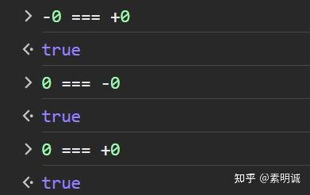

# 为什么 JavaScript 的+0 和 -0 是相等的

 **Link:** [https://zhuanlan.zhihu.com/p/656183808]

**+0 和 -0 这两个是特殊情况，虽然他们两个相等，但是他们两个有特殊的意义才这么设计的**

## 为什么需要两种零的表示：  

1. **表示特定的数学极限**： 如之前所述，考虑函数 1/x。当 x 从正数接近零时，结果趋向于正无穷。而当 x 从负数接近零时，结果趋向于负无穷。这种区分允许计算机模拟这些数学上的极限行为。
2. **数值稳定性**： 在某些数值算法中，保留 `+0` 和 `-0` 的区分可以提供更准确和稳定的结果。
3. **位级表示**： 在 IEEE 754 标准中，`+0` 和 `-0` 在位级上有所不同，尤其是在符号位上。这种区别使得我们可以在不牺牲其他功能的情况下，明确地表示和区分这两种零。

虽然这种比较，从人直觉的角度很不一致，但是这么设计的目标是为了解决数学和数值计算中的特定问题