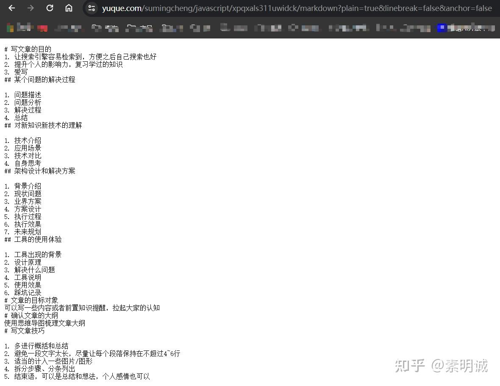

# 语雀如何显示 Markdown 代码

 

### 正常的文章链接  

`https://www.yuque.com/sumingcheng/javascript/xpqxals311uwidck`

访问后是文章，无法复制 markdown 的内容

### 在链接后增加参数  

`/markdown?plain=true&linebreak=false&anchor=false`

### 直接显示代码  
