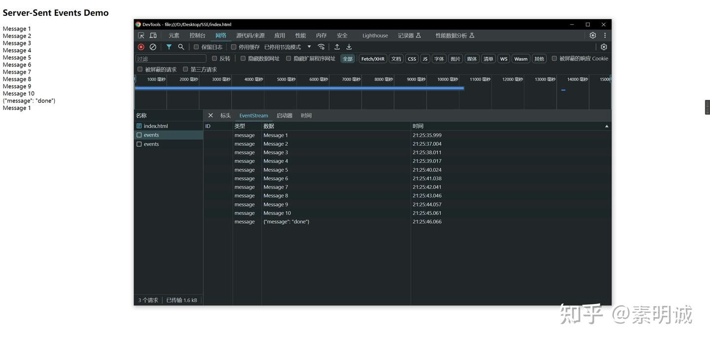

# 前端对接 Python SSE


 

### Python代码  

请求后 每10s 向前端发送数据

```
from flask import Flask, Response, json
from flask_cors import CORS
import time

app = Flask(__name__)
CORS(app)  # 允许所有域进行跨域请求

@app.route('/events')
def events():
    def generate():
        for i in range(1, 11):  # 生成10次数据
            yield f"data: Message {i}\n\n"
            time.sleep(1)  # 每秒发送一次
        
        # 发送完成信号
        yield f"data: {json.dumps({'message': 'done'})}\n\n"
    return Response(generate(), mimetype='text/event-stream')

if __name__ == '__main__':
    app.run(debug=True, threaded=True)
```
### 前端请求接口对接 SSE  
```
<!DOCTYPE html>
<html lang="en">
  <head>
    <meta charset="UTF-8" />
    <title>SSE Demo</title>
    <script>
      window.onload = () => {
        const eventSource = new EventSource('http://127.0.0.1:5000/events');
        eventSource.onmessage = function (event) {
          const data = event.data;
          console.log(data);
          if (data.message === 'done') {
            // 收到完成信号，关闭连接
            eventSource.close();
            console.log('All data received, connection closed.');
          } else {
            // 显示接收到的消息
            const message = document.createElement('div');
            message.textContent = event.data;
            document.body.appendChild(message);
          }
        };
      };
    </script>
  </head>
  <body>
    <h2>Server-Sent Events Demo</h2>
  </body>
</html>
```
