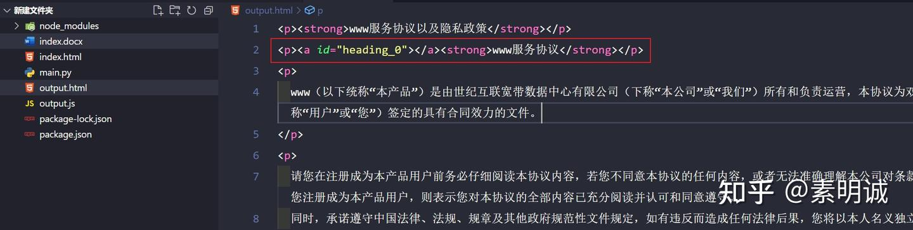

# word 转 html 保留基本格式


 **Link:** [https://zhuanlan.zhihu.com/p/688325180]

### 需要用到这个库mammoth.js  

在项目中安装

```
npm install mammoth
```

运行脚本

```
const mammoth = require('mammoth');
const fs = require('fs');

mammoth
  .convertToHtml({ path: './index.docx' })
  .then(function (result) {
    fs.writeFileSync('./output.html', result.value);
  })
  .catch(function (err) {
    console.log(err);
  });

```

转换后可以看到，很多格式都是保留下来的，更方便后期设置样式了

