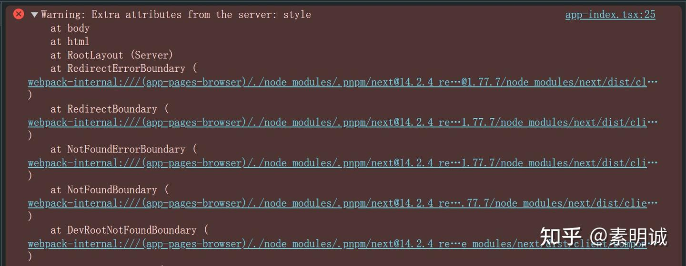
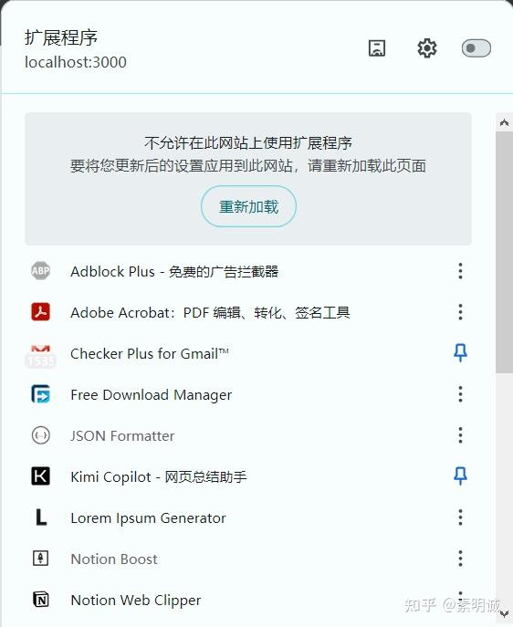

# Next.js 报错 Warning: Extra attributes from the server: style


 **Link:** [https://zhuanlan.zhihu.com/p/708271833]

## 问题原因  

发生此错误的原因是 nextjs 从服务器端收到了客户端无法识别的额外属性，简单的说就是客户端渲染和服务端渲染不匹配。

我这个项目刚初始化，使用的是next+radix-ui，配置全局主题的时候出现的错误

## 解决方法 1，忽略这个警告  

修改 layout.tsx 的 html 属性，增加 suppressHydrationWarning

```
<html suppressHydrationWarning={true}>
```
## 解决方法 2，关闭浏览器插件  

如果你有很多浏览器插件，尤其是涉及到样式和颜色，或者是文字类的，都会导致这个问题，你可以选择在开发环境下禁用这个插件

Chrome推出了一个新的测试版功能，允许用户为特定URL关闭扩展，这有助于解决相关错误。您可以通过访问 `chrome://flags/#extensions-menu-access-control` 启用“Extensions Menu Access Control”标志，并重启Chrome。启用后，您可以通过扩展程序图标来切换或启用/禁用特定URL的扩展。

## 解决方法 3，不使用错误的嵌套  

错误的嵌套如下，或者是例如`li`元素中嵌套`ul`元素，情况有很多

```
<a>
<a><a/>
<a/>
```

如果你有这个错误，大概率是这些问题导致的