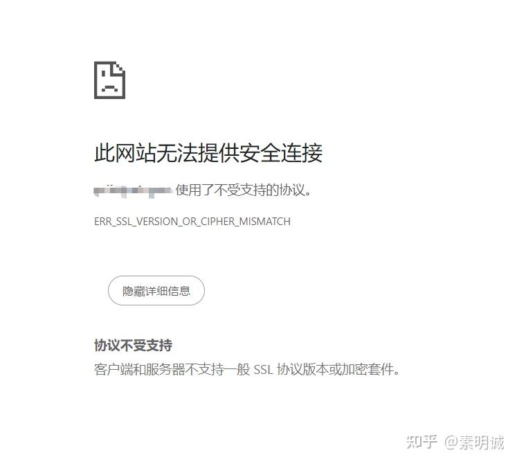

# ERR_SSL_VERSION_OR_CIPHER_MISMATCH 浏览器错误

 

## 浏览器报错  
## 错误排查  

* **确认 DNS 记录**：确保域名的 DNS 记录（如 A 记录或 CNAME 记录）正确指向了托管网站的服务器。你可以使用 `nslookup` 或 `dig` 命令来查看 DNS 解析结果。
* **检查域名指向**：使用 `ping` 命令或其他网络工具检查域名是否解析到了预期的 IP 地址。
* **SSL/TLS 证书检查**：访问网站时检查浏览器的安全信息，确认是否加载了正确的 SSL/TLS 证书。这可以在浏览器的地址栏中点击锁形图标查看。

## 解决  

经过排查后，我这边的问题是因为腾讯云变更了免费HTTPS证书的政策，取消了我的根域名解析。需要在域名解析中添加@记录，指向你的服务器的IP地址即可