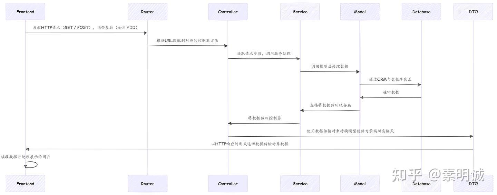

# Web 开发下 MVC 流程

 **Link:** [https://zhuanlan.zhihu.com/p/7925683319]

### 流程图  
### 前端发起请求，传递必要的参数（如用户ID）  

**前端**通过浏览器、移动客户端或其他客户端发起HTTP请求，通常是RESTful API调用（`GET`、`POST`等）。例如，前端可能请求一个特定ID的用户信息。 请求中可能携带**查询参数**（如分页参数、排序条件、筛选条件等）或**路径参数**（如用户ID），具体取决于API的设计。

### 路由层解析请求并将其转发给相应的控制器方法  

**路由层（Router）**负责解析HTTP请求并将其转发给相应的控制器方法。路由会根据请求的方法（GET、POST等）和路径（如`/api/user/{id}`）来匹配相应的控制器。 在现代Web框架（如Gin、Express、Spring等）中，路由通常会独立于控制器进行配置，路由管理器会根据URL匹配到相应的控制器方法。在某些框架中，路由层和控制器层可能是分开的。

### 控制器从请求中提取参数，并调用服务层来获取数据  

**控制器层（Controller）**负责接收请求并提取必要的参数（如用户ID、查询条件等）。控制器的主要职责是调度请求，决定需要调用哪个服务层的功能，执行相应的业务操作。 控制器层本身并不包含业务逻辑，所有的业务逻辑应交给服务层处理。控制器将接收到的参数传递给服务层，以获取或处理数据。

### 服务层处理业务逻辑，并调用数据库（通过模型）获取数据  

**服务层（Service）**专注于处理具体的业务逻辑。在这一步，服务层会执行参数验证、数据计算或其他必要的处理逻辑。 服务层通过**模型层（Model）**来访问数据库或其他持久化存储，获取、插入或更新数据。模型层通常通过ORM（如Gorm、Sequelize等）与数据库进行交互。 服务层还可能包括缓存的读取、日志记录、外部API的调用等跨域逻辑。

### 数据从数据库返回后，服务层将其返回给控制器  

在完成数据库操作后，服务层将返回的数据（通常是对象或结构化数据）传递给控制器层。 服务层通常返回的格式可以是一个模型对象，也可能是经过一定处理后的数据，取决于具体的业务需求。

### 控制器使用DTO将从数据库获取的数据转换为前端需要的格式  

控制器层将从服务层获得的**模型数据（Model）**转换为前端所需的格式，通常是通过**DTO（数据传输对象）**来实现。 DTO用于将数据格式化为API所需的标准结构，并去除不必要的字段或敏感数据（如密码、内部ID等）。 在一些复杂场景下，控制器也可能使用**ViewModel**，特别是当数据的展示层要求较高时，ViewModel更多地关注展示层的需要，可能包含计算字段或格式化的结果。

### 控制器通过HTTP响应将DTO数据返回给前端  

控制器将经过DTO转换后的数据以**HTTP响应**的形式返回给前端。响应通常以**JSON**或**XML**格式发送，具体取决于前后端约定。

### 前端接收到数据后进行处理并展示给用户  

**前端**接收到数据后，通过JavaScript等前端技术进行展示。通常，前端会基于API返回的JSON数据动态更新页面内容，使用框架如**React**、**Vue**、**Angular**等来处理数据绑定和UI渲染。 前端还可能进行一些额外的数据处理，例如**表单验证**、**UI更新**或**交互**。在复杂的前端应用中，**状态管理**（如Redux、Vuex等）可能会涉及，帮助集中管理应用的状态。

