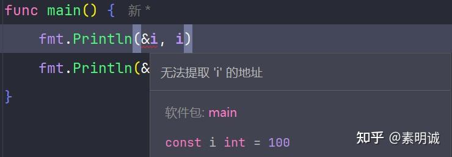

# Go 常量的设计与优势


 **Link:** [https://zhuanlan.zhihu.com/p/695281294]

### 看下面这段代码  
```
package main
​
import "fmt"
​
const i = 100
​
var j = 123
​
func main() {
    fmt.Println(&i, i)
    fmt.Println(&j, j)
}

```

无法获取到Ｉ的地址



在Go语言中，常量和变量是以不同的方式处理的，这种设计有其独特的理由和优势。常量在Go中被定义为在编译时就已知且不可变的值，它们**不占用运行时的内存地址**。这一设计是出于以下几个考虑

### 简化语义  

常量的不可变性是其核心特性。Go语言通过不允许获取常量的地址，确保常量一旦被定义，其值就不能被改变。这避免了常量值可能的修改，维持了常量“永恒不变”的语义，从而简化了常量的使用和理解。

### 编译器优化  

由于常量的值在编译期已确定，编译器可以将常量值直接内联到使用它们的代码中。这样的优化减少了运行时的内存访问，提高了代码的执行效率。

### 减少运行时开销  

如果常量占用内存地址，那么访问常量就需要内存读取操作。Go通过将常量直接内联到它们被使用的地方，避免了这种开销，使程序运行更高效。

### 避免意外的指针操作  

不允许获取常量的地址也意味着无法通过指针操作修改常量的值。这防止了程序中的非预期行为，增强了程序的稳定性和安全性。

