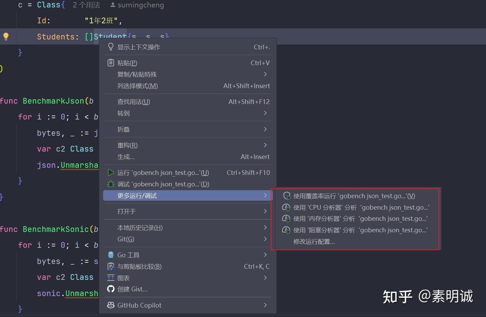

# 如何编写 Go 语言的性能测试


 **Link:** [https://zhuanlan.zhihu.com/p/704861694]

### testing包  

`testing` 包提供了一个专门用于性能测试的工具，称为基准测试（benchmarks）。基准测试函数以 `Benchmark` 开头，并接受一个 `*testing.B` 类型的参数。这个参数提供了控制测试运行的方法和属性，例如 `b.N`，它代表测试循环的次数。

### 示例代码  
```
package main
​
import (
    "encoding/json"
    "github.com/bytedance/sonic"
)
​
type Student struct {
    Name   string
    Age    int
    Gender string
}
​
type Class struct {
    Id       string
    Students []Student
}
​
var (
    s = Student{"张三", 18, "女"}
    c = Class{
        Id:       "1年2班",
        Students: []Student{s, s, s},
    }
)
// Benchmark 开头
func 
Json(b *testing.B) {
    for i := 0; i < b.N; i++ {
        bytes, _ := json.Marshal(c)
        var c2 Class
        json.Unmarshal(bytes, &c2)
    }
}
​
func BenchmarkSonic(b *testing.B) {
    for i := 0; i < b.N; i++ {
        bytes, _ := sonic.Marshal(c)
        var c2 Class
        sonic.Unmarshal(bytes, &c2)
    }
}

```
### IDE 执行  
### 命令行执行  

打开命令行或终端，在包含性能测试文件的目录下运行：

```
go test -bench=.
```

使用 `-bench` 参数可以指定要运行的基准测试。`-bench=.` 表示运行所有基准测试。

