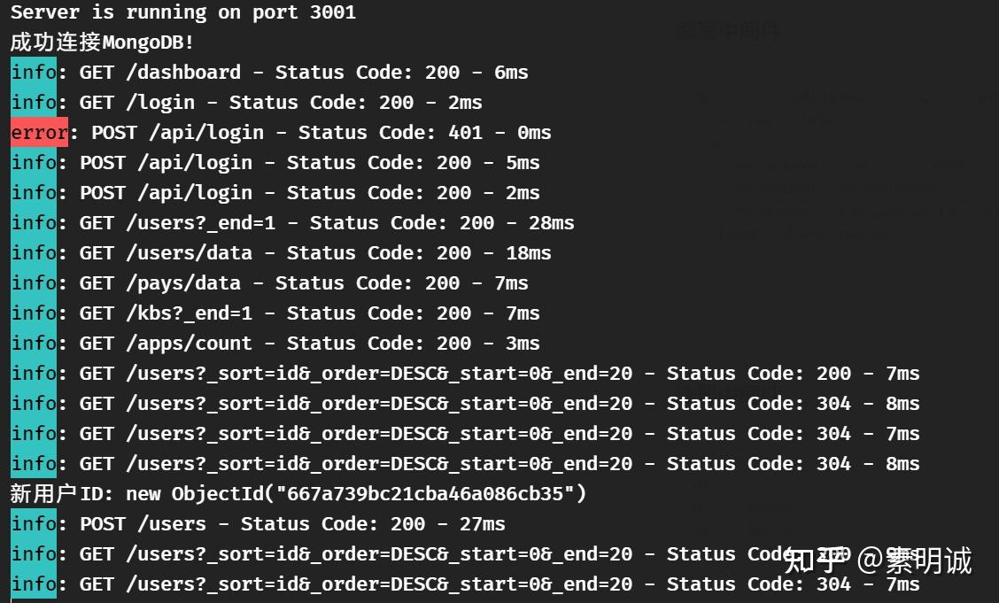

# Express 中使用 Winston 记录日志


 **Link:** [https://zhuanlan.zhihu.com/p/705343536]


**首先，你需要在你的 Node.js 项目中安装 Winston 和 winston-daily-rotate-file（**实现日志滚动**）**

```
npm install winston
npm install winston-daily-rotate-file

```
## 示例：编写一个 logger 实例导出使用  
```
import winston from 'winston';
import DailyRotateFile from 'winston-daily-rotate-file';
import fs from 'fs';
import path from 'path';

function ensureLogDirectory() {
  const logDirectory = path.join(process.cwd(), 'logs');
  if (!fs.existsSync(logDirectory)) {
    fs.mkdirSync(logDirectory, {recursive: true});
  }
  return logDirectory;
}

// 创建日志文件传输配置
function createFileTransport(logDirectory) {
  return new DailyRotateFile({
    filename: path.join(logDirectory, 'admin-%DATE%.log'),
    datePattern: 'YYYY-MM-DD',
    zippedArchive: true,
    maxSize: '20m',
    maxFiles: '14d',
    format: winston.format.combine(
      winston.format.colorize(),
      winston.format.timestamp({format: 'YYYY-MM-DD HH:mm:ss'}),
      winston.format.printf(info => `${info.timestamp} ${info.level}: ${info.message}`)
    ),
  });
}

// 创建控制台传输配置
function createConsoleTransport() {
  return new winston.transports.Console({
    level: 'debug',
    format: winston.format.combine(
      winston.format.colorize(),
      winston.format.simple()
    )
  });
}

const logDirectory = ensureLogDirectory();
const transport = createFileTransport(logDirectory);
const consoleTransport = createConsoleTransport();

// 初始化并导出logger
export const logger = winston.createLogger({
  transports: [
    transport,
    consoleTransport
  ]
});

```
## 编写中间件  
```
export const logMiddleware = (req, res, next) => {
  const start = Date.now();
  res.on('finish', () => {
    const duration = Date.now() - start;
    const logLevel = res.statusCode >= 400 ? 'error' : 'info';
    const message = `${req.method} ${req.url} - Status Code: ${res.statusCode} - ${duration}ms `;
    logger[logLevel](message);
  });
  next();
};

```
## 注册中间件  
```
const app = express();
app.use(cors());
app.use(express.json());
app.use(express.static('dist'));
app.use(logMiddleware); // 这里

```
## 效果  
## 项目地址  
[https://github.com/winstonjs/winston](https://github.com/winstonjs/winston)
