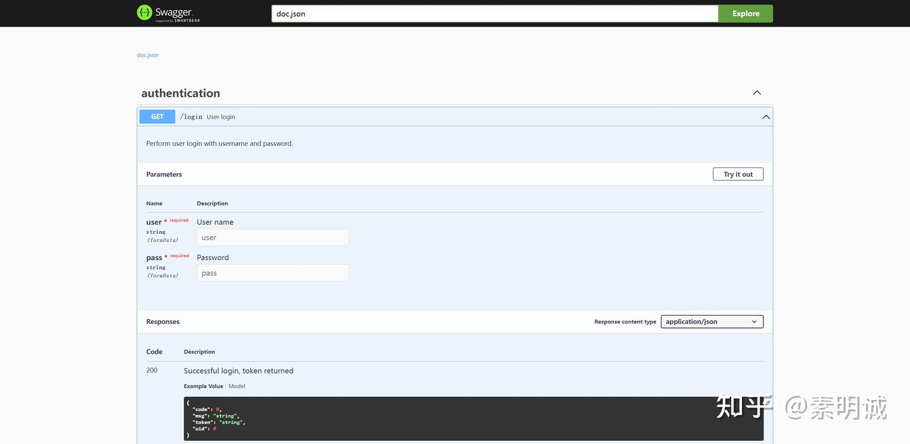

# Go 使用 Swagger

### 安装 Swagger

使用 Go 的包管理工具安装 `swag` 命令行工具，这个工具用于自动生成 Swagger 文档的相关文件。

```
go get -u github.com/swaggo/swag/cmd/swag
```

### 在 bin 目录安装

```
go install github.com/swaggo/swag/cmd/swag@latest
```

### 生成 Swagger 文档

在项目的根目录下运行 `swag init` 命令。这将会扫描你的 Go 源代码文件（通常是查找特定的注解格式），并在项目中生成一个 `docs` 文件夹，里面包含 `swagger.json`、`swagger.yaml` 和 `docs.go`。

```
swag init
```

### 安装 Gin 与 Swagger 的集成库

需要安装 `swaggo/gin-swagger` 与 `swaggo/files` 包，用于在 Gin 应用程序中提供 Swagger UI。

```
go get -u github.com/swaggo/gin-swagger
go get -u github.com/swaggo/files
```

### 配置 Gin 路由以提供 Swagger UI

修改你的 Gin 应用程序代码，引入 Swagger 文档生成的包，并设置一个路由来提供 Swagger UI。

```
package main
​
import (
    "github.com/gin-gonic/gin"
    swaggerFiles "github.com/swaggo/files"
    ginSwagger "github.com/swaggo/gin-swagger"
    _ "your_project/docs" // 替换 your_project 为实际的项目名或路径 必须导入
)
​
func main() {
    r := gin.Default()
​
    // 设置 Swagger 的路由
    r.GET("/swagger/*any", ginSwagger.WrapHandler(swaggerFiles.Handler))
​
    // 运行 Gin
    r.Run()
}
```

### 注解你的 API

在你的 API 控制器或处理器函数上添加必要的注解，以便 `swag` 能够识别并生成正确的 API 文档。

```
// @Summary 概述你的接口
// @Description 详细描述接口功能
// @Tags 使用适当的标签
// @Accept json
// @Produce json
// @Param name query string true "参数描述"
// @Success 200 {object} YourResponseStruct "成功返回的结构体描述"
// @Router /your_route [get]
func YourHandler(c *gin.Context) {
    // 实现功能
}
```

**重新生成文档并测试**： 每次更新注解后，你需要重新运行 `swag init` 以更新 Swagger 文档。然后启动你的 Gin 应用程序，访问 Swagger UI 确认 API 文档是否正确。

## 仓库地址  
[https://github.com/swaggo/swag](https://github.com/swaggo/swag)
