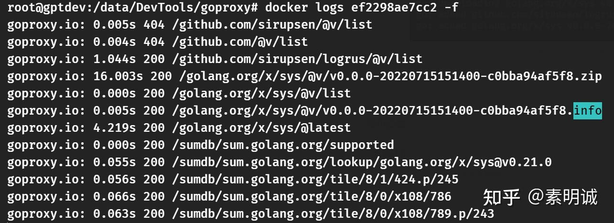
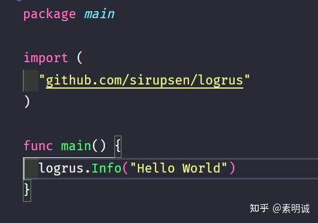

# Go 搭建并使用 goproxy 作为代理服务器


 **Link:** [https://zhuanlan.zhihu.com/p/706537626]

## 安装 goproxy  

仓库地址：[https://github.com/goproxyio/goproxy](https://github.com/goproxyio/goproxy)

```
services:
  goproxy:
    image: goproxy/goproxy:latest
    command: "-listen=0.0.0.0:8081 -cacheDir=/ext"
    ports:
      - "8081:8081"
    restart: always
    environment:
      - HTTP_PROXY=http://172.22.220.64:7890 # 代理地址
      - HTTPS_PROXY=http://172.22.220.64:7890 # 这个得有，否则白玩
    volumes:
      - ./cacheDir:/ext
```
## 配置代理  

如果要测试的话先清除缓存

```
go clean -modcache
```

设置为自己搭建的代理，我这里的测试环境的windows。注意使用`export`是替换该环境变量之前的值，而不是添加新值到现有的列表中

```
export GOPROXY=http://172.22.220.64:8081
```

查看配置

```
go env GOPROXY
```

下载包

```
go get -v github.com/sirupsen/logrus
```
### 测试  


成功~

  
  
### 使用场景  

**企业内部**：企业可以搭建内部的 `goproxy` 服务器，用来提供企业内部使用的私有模块，同时也可以缓存公共模块，减少对外部网络的依赖。

**开源社区**：开源项目可以设置使用公共的 `goproxy` 服务，如 `goproxy.cn` 或 `goproxy.io`，这些都是为了提供更快速的模块下载服务而设立的。

**个人开发者**：个人开发者也可以使用公共的或私有的 `goproxy` 实例来优化自己的开发流程，尤其是在网络连接不佳的情况下。

