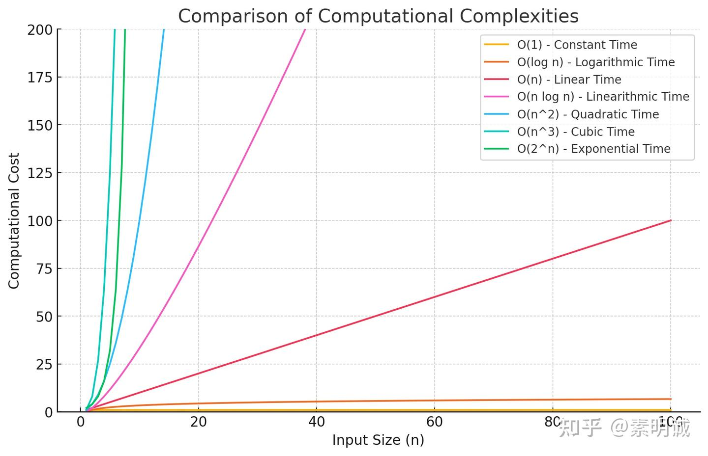

# 算法中的大O表示法（Big O notation）


 **Link:** [https://zhuanlan.zhihu.com/p/707485463]


大O表示法（Big O notation）源自数学中的“渐进符号”，用来描述函数当输入值趋向无穷大时的增长率 在算法分析中，我们通常关注最坏情况的时间复杂度，即输入数据量极大时，算法执行时间的上界

这种表示法的重点是帮助我们抽象化算法的性能，忽略具体实现的细节和低阶增长，只关注主导行为 例如，一个算法的时间复杂度可能是 `3n^2 + 5n + 7`，但我们会用 O(n^2) 来描述它，因为当 n 足够大时，n^2 项是决定性因素

通过这种方式，大O表示法为算法设计和分析提供了一个清晰、一致的框架，使得不同算法间的比较和选择更加基于理论和数学基础，而不仅仅是经验 这有助于在实际应用中优化性能和资源使用

## 不考虑的因素  

**具体执行时间**：大O不关心算法执行的具体秒数，因为这受到太多外部因素的影响，如处理器速度、系统负载、编译器优化等

**系数和低阶项**：在大O表示法中，忽略系数和低阶项是因为它们对于大规模数据的影响较小

**常数时间**：即使某些操作（如数据复制、移动等）在实际执行中需要时间，大O分析中常常假设这些操作的时间是常数，并聚焦于变化最显著的部分

## Go 语言示例  
### O(1) - 常数时间复杂度  

操作的执行时间不依赖于输入数据的大小 例如，访问数组中的特定元素

```
func getFirstElement(elements []int) int {
    return elements[0] // 总是返回数组的第一个元素
}

```
### O(log n) - 对数时间复杂度  

通常见于“分而治之”的策略，如二分搜索

```
func binarySearch(slice []int, target int) int {
    low := 0
    high := len(slice) - 1
​
    for low <= high {
        mid := low + (high-low)/2
        if slice[mid] < target {
            low = mid + 1
        } else if slice[mid] > target {
            high = mid - 1
        } else {
            return mid
        }
    }
    return -1
}

```
### O(n) - 线性时间复杂度  

操作的执行时间与输入数据的大小成正比 例如，计算所有元素的总和

```
func sumElements(elements []int) int {
    sum := 0
    for _, v := range elements {
        sum += v
    }
    return sum
}

```
### O(n log n) - 线性对数时间复杂度  

常见于某些高效的排序算法，如归并排序

```
func merge(left, right []int) []int {
    result := make([]int, 0, len(left)+len(right))
    for len(left) > 0 && len(right) > 0 {
        if left[0] < right[0] {
            result = append(result, left[0])
            left = left[1:]
        } else {
            result = append(result, right[0])
            right = right[1:]
        }
    }
    result = append(result, left...)
    result = append(result, right...)
    return result
}
​
func mergeSort(elements []int) []int {
    if len(elements) < 2 {
        return elements
    }
    mid := len(elements) / 2
    return merge(mergeSort(elements[:mid]), mergeSort(elements[mid:]))
}

```