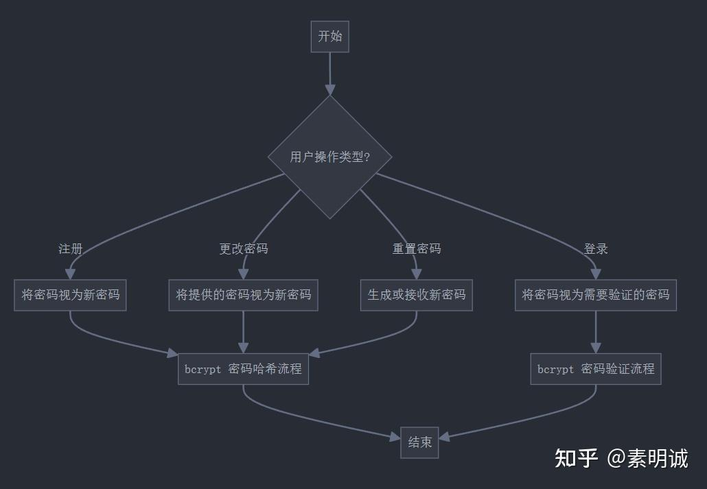
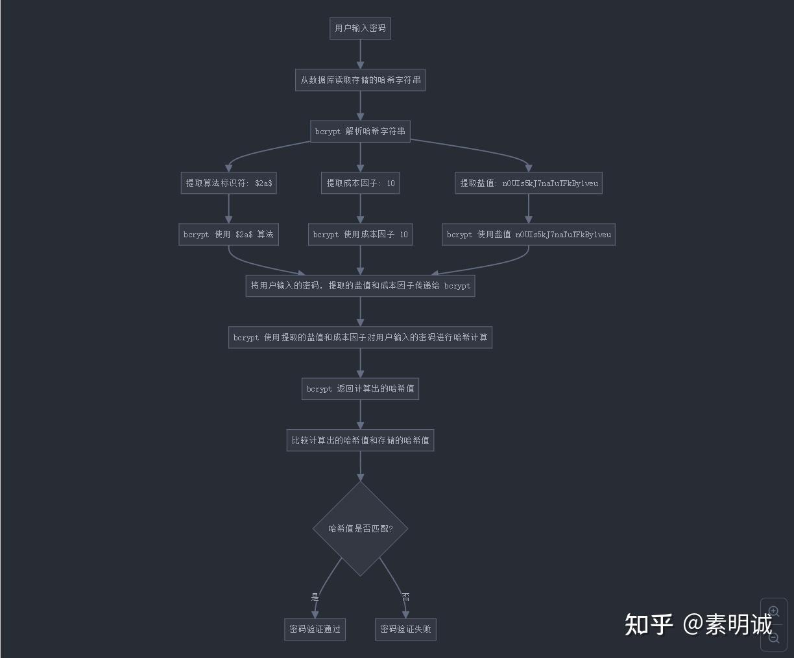

# Go bcrypt 加密和验证


 **Link:** [https://zhuanlan.zhihu.com/p/712249435]

## 用户密码操作逻辑  
## 解密原理  

假设用户加密后的密码是 $2a$10$nOUIs5kJ7naTuTFkBy1veuK0kSxUFXfuaOKdOKf9xYT0KKIGSJwFa

应用程序从数据库读取存储的 bcrypt 哈希字符串，就是上面那一串

### bcrypt 库解析这个哈希字符串  

* 提取算法标识符: $2a$
* 提取成本因子: 10
* 提取盐值: nOUIs5kJ7naTuTFkBy1veu

### bcrypt 解密流程  

* bcrypt 库现在知道它需要使用 $2a$ 算法,成本因子 10,以及盐值 nOUIs5kJ7naTuTFkBy1veu。
* 应用程序将用户输入的密码,提取的盐值 (nOUIs5kJ7naTuTFkBy1veu) 和成本因子 (10) 传递给 bcrypt。
* bcrypt 使用提供的盐值和成本因子,根据 $2a$ 算法对用户输入的密码进行哈希计算。
* bcrypt 返回计算出的哈希值。
* 程序比较计算出的哈希值和存储的哈希值 (K0kSxUFXfuaOKdOKf9xYT0KKIGSJwFa)。
* 如果两个哈希值匹配,则密码验证通过。否则,密码验证失败。

## 流程图如下  
## Go 加密解密示例代码  
```
package main

import (
    "fmt"
    "golang.org/x/crypto/bcrypt"
)

func main() {
    // 原始密码
    password := "MyPassword123"

    // 加密密码
    hashedPassword, err := bcrypt.GenerateFromPassword([]byte(password), bcrypt.DefaultCost)
    if err != nil {
        fmt.Println("加密错误:", err)
        return
    }
    fmt.Println("加密后的密码:", string(hashedPassword))

    // 验证密码
    err = bcrypt.CompareHashAndPassword(hashedPassword, []byte(password))
    if err != nil {
        fmt.Println("密码不匹配")
    } else {
        fmt.Println("密码匹配")
    }
}

```
