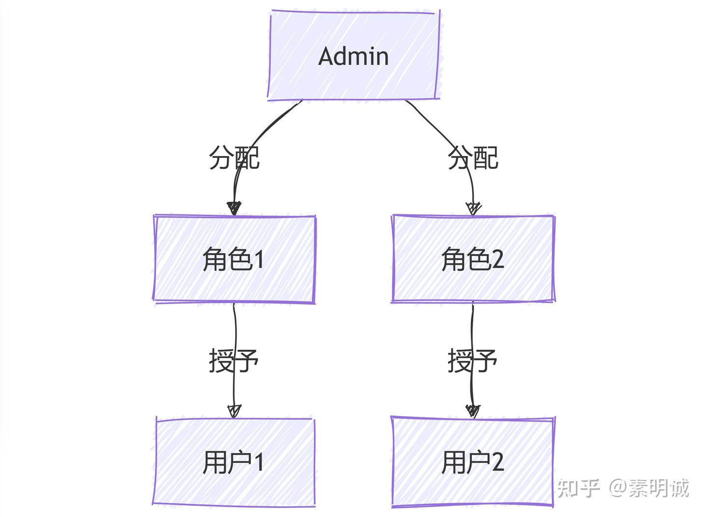
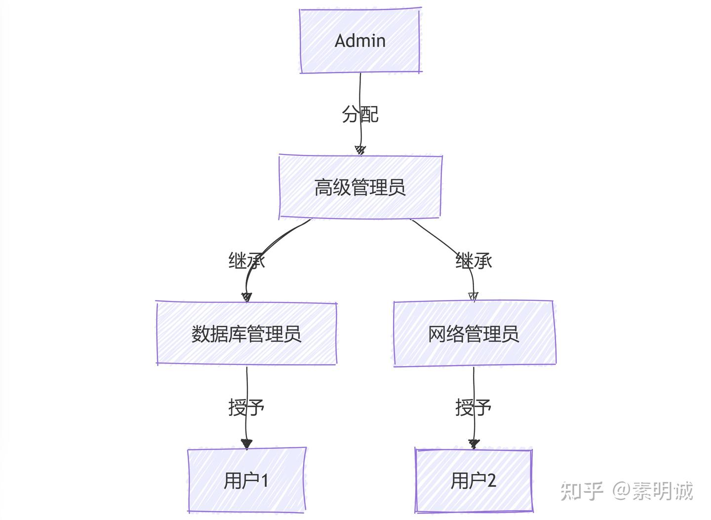
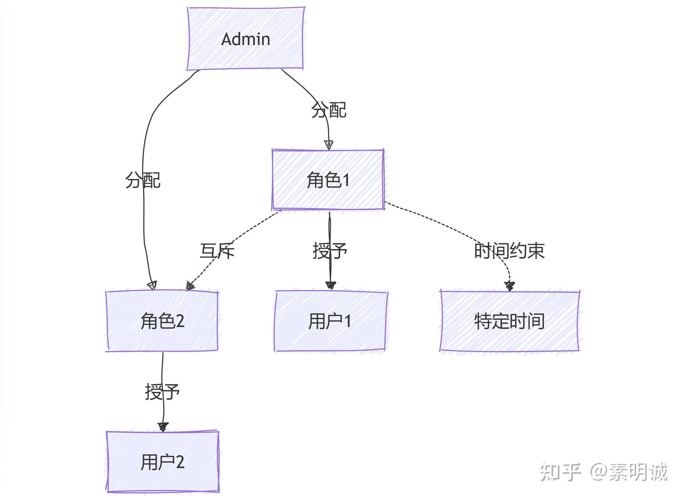
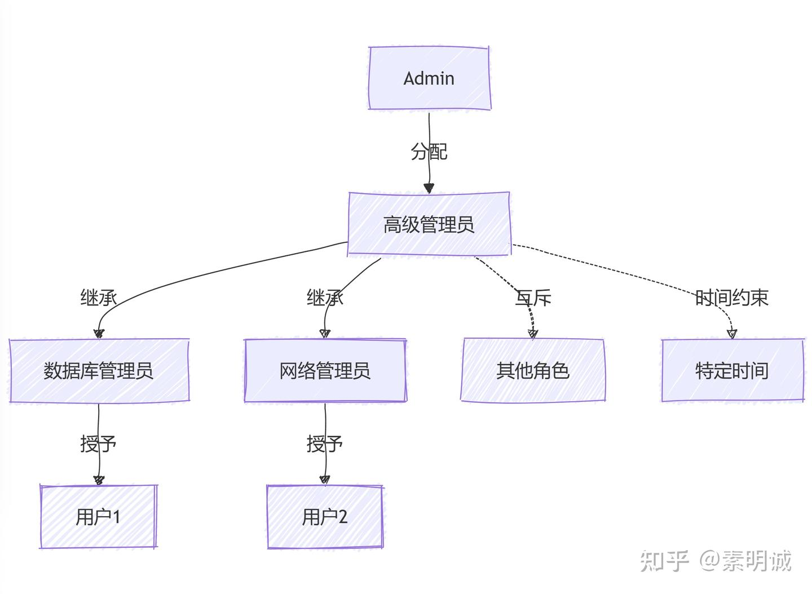

# 四种主要RBAC模型

 

**角色基于访问控制（RBAC）**是一种广泛使用的访问控制机制，它通过将权限与角色关联，而不是直接与单个用户关联，从而简化了权限管理。RBAC可以根据不同的复杂度分为多个级别，这些级别能够满足不同安全需求的组织。

### RBAC0 - 基础RBAC  

RBAC0是最简单的RBAC模型，实现了RBAC的核心概念。在这个模型中，系统管理员将权限分配给角色，然后将角色分配给用户。用户通过其角色获得执行特定任务所需的权限。这种模型是RBAC的基本形式，适用于访问控制需求相对简单的环境。

### RBAC1 - 具有角色层级的RBAC  

在RBAC1模型中，角色之间可以建立层级关系，形成父子角色的结构。子角色继承父角色的所有权限，并且可以拥有特定的附加权限。这种层级结构使得权限管理更加灵活和精细。例如，某个“高级管理员”角色可以包含多个子角色，如“数据库管理员”和“网络管理员”，这些子角色继承“高级管理员”的通用权限，同时也可以有独立的特定权限。

### RBAC2 - 具有约束的RBAC  

RBAC2模型在RBAC的基础上增加了约束条件，以实现更细粒度的安全控制。这些约束包括角色的互斥性（例如，禁止同一用户同时拥有财务和审计角色），以及基于时间或上下文的约束（例如，某个角色的权限只在特定时间或满足特定条件下有效）。这种模型适用于对安全性有较高要求的环境，能够防止潜在的权限滥用。

### RBAC3 - 综合RBAC  

RBAC3是最全面的RBAC模型，结合了RBAC1中的角色层级和RBAC2中的约束规则。它提供了完整的访问控制机制，适用于对安全性和权限管理有严格要求的复杂系统。通过同时引入层级结构和约束条件，RBAC3能够在确保安全性的同时，提供更大的灵活性和可扩展性。

