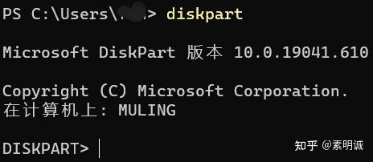
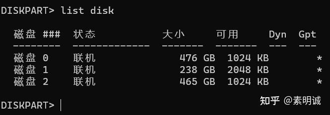
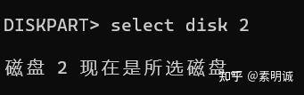
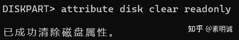
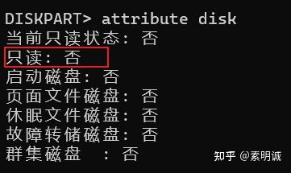

# 硬盘被写保护去除方法

 **Link:** [https://zhuanlan.zhihu.com/p/606597274]

**以管理员身份运行命令提示符（Win+R）**  
输入命令 diskpart

 进入diskpart的界面

  
  

  
**输入命令 list disk 回车** 

选择想去除保护的磁盘

  
  

  
 **输入命令select disk 2 回车 磁盘2是我想清除属性的盘，你可以选择你想清除的。**  

 **输入命令attribute disk clear readonly 回车** 

 **输入命令attribute disk回车 查看** 

  
  
**若有收获，就点个赞吧**

