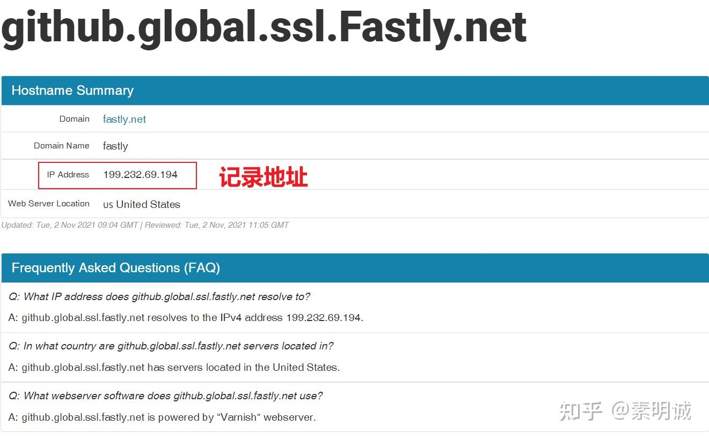
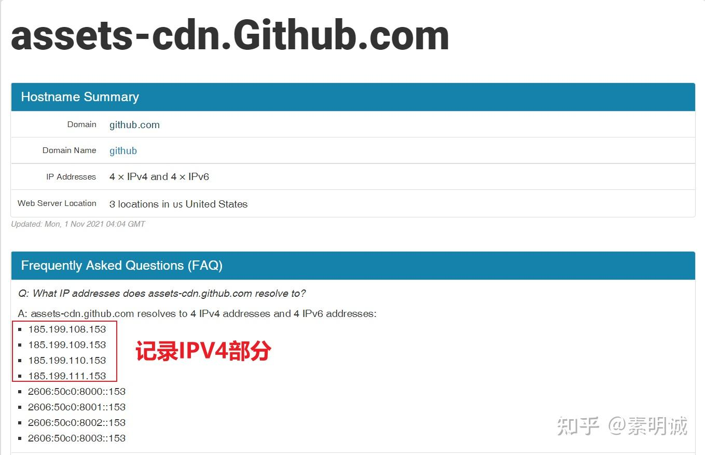

# 解决：GitHub push 不上去


 **Link:** [https://zhuanlan.zhihu.com/p/653056038]

## 一、配置host方法  
## 1.https://github.com.ipaddress.com/  

  


  


## 2.https://fastly.net.ipaddress.com/github.global.ssl.fastly.net#ipinfo  

  




  


## 3.https://github.com.ipaddress.com/assets-cdn.github.com  

  




  


## 4.打开hosts文件，把记录的IP和对应的域名写上  
```
140.82.112.3 github.com //图1
199.232.69.194 github.global.ssl.fastly.net    //图2
185.199.108.153 assets-cdn.github.com  //图3
185.199.109.153 assets-cdn.github.com  //图3
185.199.110.153 assets-cdn.github.com	 //图3
185.199.111.153 assets-cdn.github.com  //图3
```
## 二、修改本地host  
```
140.82.112.3 github.com
```
## 刷新本地的DNS  
```
ipconfig /displaydns
```
## 其他错误  
## error 11053  
```
git config --global http.postBuffer 524288000
```
## 三、刷新代理  
## 配置/取消http代理  
```
# 配置socks5代理
git config --global http.proxy 'socks5://127.0.0.1:1080'
git config --global https.proxy 'socks5://127.0.0.1:1080'
# 配置http代理
git config --global http.proxy 'http://127.0.0.1:1080'
git config --global https.proxy 'https://127.0.0.1:1080'
git config --global --unset http.proxy
```
## 配置/取消HTTPS代理  
```
git config --global https.proxy
git config --global --unset https.proxy
```
## 四、指定代理的作用域  
```
#只对github.com
git config --global http.https://github.com.proxy socks5://127.0.0.1:7890
```

四种方法，最终肯定会解决你的问题，如果能开了代理，可以直接指定本地的代理软件，也就是按照四进行操作