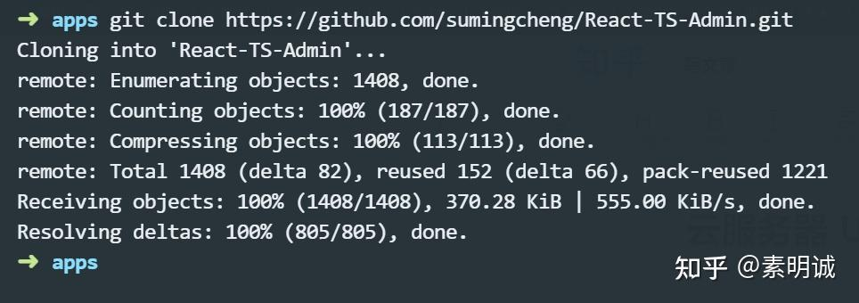

# 云服务器 Ubuntu 如何访问 GitHub


 **Link:** [https://zhuanlan.zhihu.com/p/686948724]

### 打开项目地址，你可以按照项目markdown进行操作  
[https://github.com/521xueweihan/GitHub520](https://github.com/521xueweihan/GitHub520)### 或者，直接复制它更新的hosts  
### 1. 备份当前文件  
```
sudo cp /etc/hosts /etc/hosts.backup
```
### 2. 编辑 hosts 文件  
```
sudo nano /etc/hosts
```

将从 GitHub520 项目页面复制的 hosts 文件内容粘贴到本地的 `/etc/hosts` 文件中。确保不要删除或覆盖文件中已有的内容，特别是关于 `localhost` 的配置。

### 3. 保存后退出  

重启计算机或者 `sudo systemctl restart NetworkManager`

重新 clone 项目


