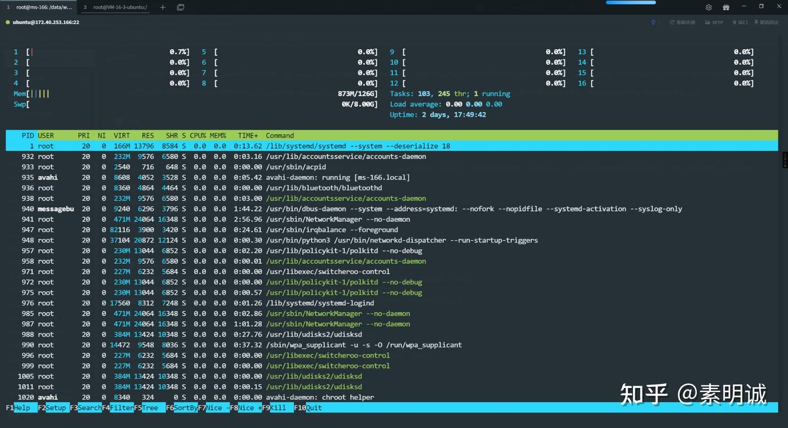

# htop 界面功能详解

 **Link:** [https://zhuanlan.zhihu.com/p/691875740]

### Tabby Terminal  

这是我的当前终端界面，我将进行详细介绍

### 顶部区域，状态  

**CPU 使用条**：每个 CPU 核心对应一个使用条，显示 CPU 的使用情况不同的颜色表示不同类型的 CPU 使用，如用户空间、内核空间等

**内存 (Mem) 使用条**：显示物理内存（RAM）的总使用情况颜色通常区分了用于缓存的内存和实际使用的内存，不同版本可能颜色不同

* **绿色**：表示正在使用的内存（Resident Memory），即分配给进程并且目前位于 RAM 中的内存。
* **蓝色**：表示缓冲区（Buffers），由内核用来缓存文件系统的元数据和跟踪磁盘块等信息，以加速访问磁盘。
* **黄色/橙色**：表示缓存（Cache），由操作系统用来存储临时文件以快速读取。这部分内存可以由操作系统在需要时回收，用于其他更重要的任务。
* **红色**：表示内存中的页面（通常是内容）已经被标记为需要写回到磁盘的交换空间。
* **灰色**：代表内核栈，用于内核操作的内存空间。

**交换 (Swp) 使用条**：显示交换分区（swap space）的使用情况交换空间是当物理内存不足时，用作内存的一个硬盘空间

### 中间区域，进程列表  

**PID**：进程的唯一标识符

**USER**：运行该进程的用户

**PRI**：进程的优先级

**NI**：进程的 nice 值，影响其优先级

**VIRT**：进程使用的虚拟内存总量

**RES**：进程使用的、未被交换出去的物理内存大小

**SHR**：进程使用的共享内存大小

**S**：进程的状态（例如 S 代表 sleeping，R 代表 running）

**CPU%**：进程使用的 CPU 百分比

**MEM%**：进程使用的物理内存百分比

**TIME+**：进程自启动以来的总 CPU 时间

**Command**：启动进程的命令

### 底部区域，快捷功能  

**F1 Help**：显示帮助界面

**F2 Setup**：进入设置界面，可以配置 `htop` 的外观和行为

**F3 Search**：搜索进程

**F4 Filter**：过滤进程列表

**F5 Tree**：以树状结构显示进程

**F6 SortBy**：选择排序方式

**F7 Nice -**：降低进程的 nice 值（优先级）

**F8 Nice +**：提高进程的 nice 值

**F9 Kill**：杀死进程

**F10 Quit**：退出 `htop`

### 右上角，  

**Tasks**：系统中的总任务数，也就是进程数

**Load average**：系统在过去 1 分钟、5 分钟和 15 分钟的平均负载

**Uptime**：系统运行时间

  

**如果您喜欢这篇文章，不妨给它点个赞并收藏，这对我来说意义非凡！感谢您的支持！**

