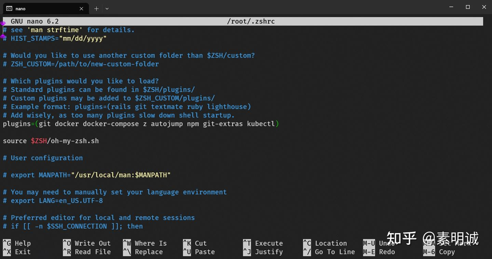
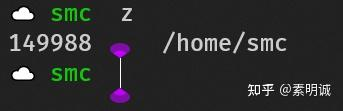
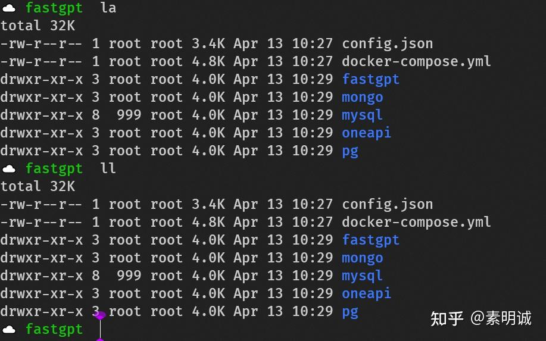

# Oh My Zsh 常用插件推荐

 

### 通过 plugins 添加插件  
### 1.z  

* **作用**，`z` 插件允许你快速跳转到最常访问的目录，基于“frecent”使用频率和最近使用时间算法。
* **用法**，在终端中键入 `z 关键词`，插件将会将你带到匹配关键词的最常访问目录。

### 2.autojump  

* **作用**，和 `z` 类似，`autojump` 提供一种更快方式来导航你的文件系统，也是基于你的历史导航记录。
* **用法**，使用 `j 关键词` 来跳转到一个目录，这个目录包含了关键词并且是你经常访问的。

### 3.command-not-found  

* **作用**，当你尝试运行一个未安装的命令时，`command-not-found` 会提示你如何安装这个命令。
* **用法**，自动触发，当你输入一个未识别的命令时会看到安装建议。

### 4.common-aliases  

* **作用**，提供一系列常见的别名来简化命令行操作。
* **用法**，例如 `ll` 为 `ls -l`，`la` 为 `ls -a` 等。

### 5.npm  

* **作用**，为常用的 npm 命令提供别名和简化操作。
* **用法**，例如 `npmgs` 查看全局安装的 npm 包，`npmi` 用于安装依赖等。

### 6.git-extras  

* **作用**，添加一些额外的 git 工具，扩展 git 的功能。
* **用法**，提供诸如 `git-undo`、`git-setup`、`git-changelog` 等命令。

### 7.web-search  

* **作用**，允许你直接从命令行发起网络搜索。
* **用法**，键入 `google 关键词`、`bing 关键词` 等。当然，这个是针对图形化版本的，命令行就算了

### 8.sudo  

* **作用**，允许你通过按两次 Esc 键将 `sudo` 前缀添加到最近的命令。
* **用法**，在你输入命令后发现需要权限提升时，双击 `Esc`。

### 9.python  

* **作用**，为 Python 开发者提供快速别名和功能。
* **用法**，包括用于激活虚拟环境的 `pyworkon` 等。

### 10.pip  

* **作用**，提供 pip 命令的别名和快速使用功能。
* **用法**，例如 `pipi` 安装包，`pipu` 升级包等。

### 11.vi-mode  

* **作用**，在 Zsh 中启用 Vim 键盘快捷键。
* **用法**，启用后，你可以在命令行中使用 Vim 风格的键位操作。

### 12.kubectl  

* **作用**，为 Kubernetes 的 `kubectl` 命令提供别名和自动补全功能。
* **用法**，例如 `k` 代替 `kubectl`，`kgp` 为 `kubectl get pods` 等。

  

如果您喜欢这篇文章，不妨给它点个赞并收藏，感谢您的支持！