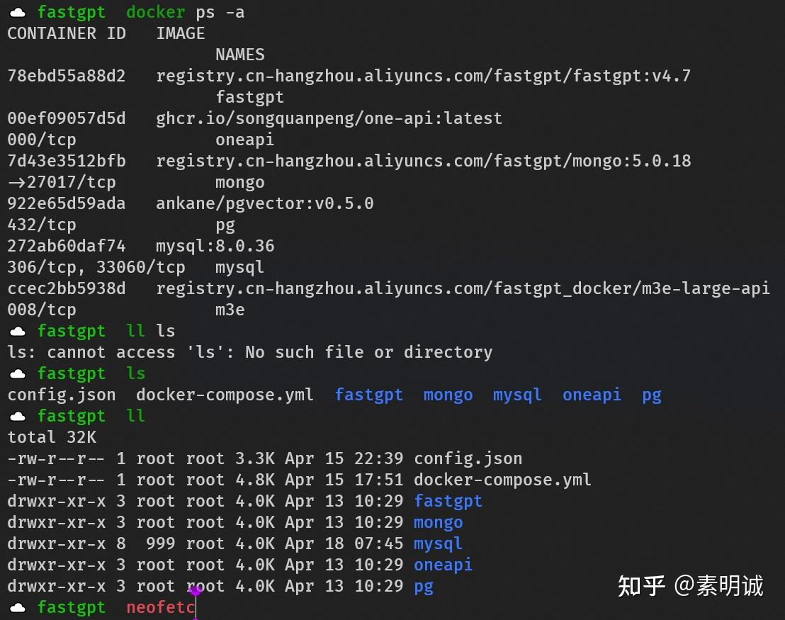

# Ubuntu 配置 zsh-syntax-highlighting 实现命令检查


 

### 安装 Zsh  

确保你的系统上已经安装了 Zsh

```
# 对于 macOS
brew install zsh
​
# 对于 Ubuntu/Debian
sudo apt install zsh
​
# 对于 CentOS/RHEL
sudo yum install zsh
​
# 对于 Fedora
sudo dnf install zsh
```
### 设置 Zsh 为默认 Shell  

将 Zsh 设置为默认的 Shell

```
chsh -s $(which zsh)
```

你可能需要退出并重新登录，或重启系统以应用更改。

### 安装 Oh My Zsh  

Oh My Zsh 是一个流行的开源框架，用于管理你的 Zsh 配置。你可以通过以下命令来安装它

```
sh -c "$(curl -fsSL https://raw.github.com/ohmyzsh/ohmyzsh/master/tools/install.sh)"
```
### 安装 zsh-syntax-highlighting 插件  

现在，你可以通过 git 克隆 `zsh-syntax-highlighting` 插件到 Oh My Zsh 的插件目录

```
git clone https://github.com/zsh-users/zsh-syntax-highlighting.git ${ZSH_CUSTOM:-~/.oh-my-zsh/custom}/plugins/zsh-syntax-highlighting
```
### 配置 zsh-syntax-highlighting 插件  

接下来，你需要配置 Oh My Zsh 以使用 `zsh-syntax-highlighting` 插件。通过编辑你的 `~/.zshrc` 文件来完成这一步

```
nano ~/.zshrc
```

找到 `plugins` 这一行，并添加 `zsh-syntax-highlighting`

```
plugins=(git zsh-syntax-highlighting)
```

重点！确保 `zsh-syntax-highlighting` 在插件列表的最后一项，因为它需要在其他插件之后加载。

### 重新加载配置  

保存并关闭 `~/.zshrc` 文件，然后通过下面的命令来重新加载配置

```
source ~/.zshrc
```
### 配置成功效果如下  

通过检查就是绿色

没有通过就是红色，可以帮助快速判断命令是否敲错了



**如果您喜欢，希望能点赞支持一下**