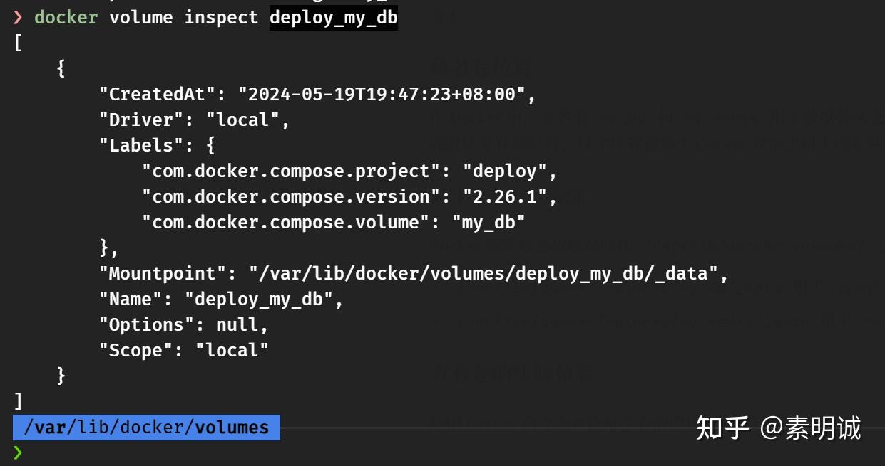

# docker-compose 配置卷示例


 

## 示例  
```
version: '3.8'
​
services:
  mysql:
    image: mysql:8.0.36
    container_name: tcm-mysql
    environment:
      MYSQL_ROOT_PASSWORD: 123114
      MYSQL_DATABASE: tcm_department_syndrome  # 设置数据库名称
    ports:
      - "3306:3306"
    volumes:
      - my_db:/var/lib/mysql
    restart: always
​
  redis:
    image: redis:6.2.6
    container_name: tcm-redis
    ports:
      - "6379:6379"
    volumes:
      - my_redis:/data
    restart: always
​
volumes:
  my_db:
  my_redis:
​
```
## 卷驱动（Volume Driver）  

**本地驱动**：`local` 表示使用 Docker 自带的本地卷驱动来管理卷。这是最常见的卷驱动，用于在宿主机的文件系统上创建和管理卷。

**其他驱动选项**：Docker 还支持其他类型的卷驱动，例如 `azure`、`gcp`、`aws` 等，这些驱动允许你将数据存储在远程的云存储服务上。

### 命名卷位置  

在 Docker 中，命名卷 `my_db` 和 `my_redis` 用于数据持久化，确保数据不会因为容器的删除而丢失。命名卷通常存储在 Docker 的默认卷存储位置，这个位置依赖于 Docker 在宿主机上的安装配置。

## 对于 Linux 系统  

Docker 通常将卷数据存储在 `/var/lib/docker/volumes/` 目录下。你可以在该目录下找到以卷名命名的子目录，例如：

* `/var/lib/docker/volumes/my_db/_data` 用于 `mysql` 服务的数据。
* `/var/lib/docker/volumes/my_redis/_data` 用于 `redis` 服务的数据。

## 查看卷的实际位置  

使用 Docker 命令来查找每个卷的确切存储位置

```
docker volume inspect my_db
docker volume inspect my_redis
```
