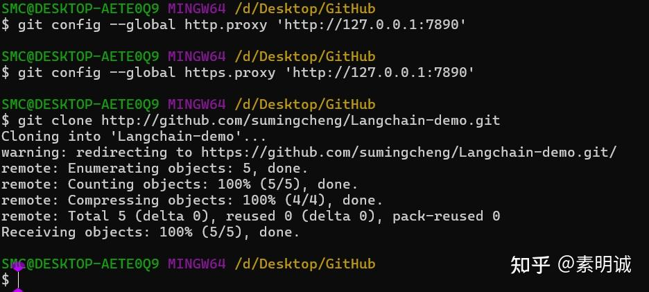

# 配置 Git 走本地代理

### 配置 Git 使用 SOCKS5 代理

如果您的软件代理是 SOCKS5 代理，可以通过以下命令配置 Git 使用 SOCKS5 代理（假设代理地址是`127.0.0.1`，端口是`7890`）

```
git config --global http.proxy 'socks5://127.0.0.1:7890'
git config --global https.proxy 'socks5://127.0.0.1:7890'
```

### 配置 Git 使用 HTTP 代理

如果您使用的是 HTTP 代理，配置方法类似（假设代理地址是`127.0.0.1`，端口是`7890`）

```
git config --global http.proxy 'http://127.0.0.1:7890'
git config --global https.proxy 'http://127.0.0.1:7890'
```

### 验证配置

配置完成后，您可以通过查看 Git 配置来验证代理设置是否成功

```
git config --global --get http.proxy
git config --global --get https.proxy
```

### 取消代理配置

如果您想取消 Git 的代理配置，可以使用以下命令

```
git config --global --unset http.proxy
git config --global --unset https.proxy
```

### 配置后 clone 项目会更快一些


