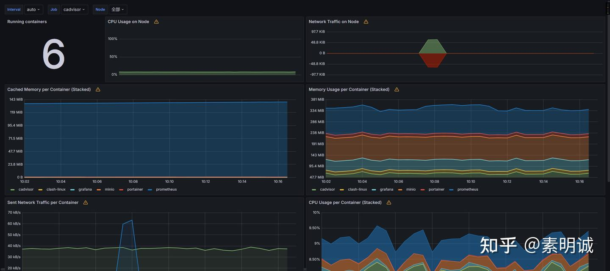

# 监控单机 Docker 容器，使用 cAdvisor、Prometheus 和 Grafana

## docker-compose.yml

```
services:
  prometheus:
    image: prom/prometheus:v2.53.0
    container_name: prometheus
    volumes:
      - ./prometheus.yml:/etc/prometheus/prometheus.yml
      - prometheus_data:/prometheus
    ports:
      - "59090:9090"
    networks:
      - monitor-net
    restart: unless-stopped
    command:
      - '--config.file=/etc/prometheus/prometheus.yml'
      - '--storage.tsdb.path=/prometheus'
      - '--web.enable-lifecycle'
    depends_on:
      - cadvisor
    logging:
      driver: json-file
      options:
        max-size: "200m"
        max-file: "10"
  grafana:
    image: grafana/grafana:10.4.4
    container_name: grafana
    volumes:
      - grafana_data:/var/lib/grafana
      - ./grafana.ini:/etc/grafana/grafana.ini #  Grafana 配置文件
    environment:
      GF_SECURITY_ADMIN_PASSWORD: admin123456 # 管理员密码
      GF_USERS_ALLOW_SIGN_UP: "false" # 禁止用户自行注册
    ports:
      - "53000:3000"
    networks:
      - monitor-net
    restart: unless-stopped
    depends_on:
      - prometheus
    logging:
      driver: json-file
      options:
        max-size: "200m"
        max-file: "10"
  cadvisor:
    image: gcr.io/cadvisor/cadvisor
    container_name: cadvisor
    volumes:
      - /:/rootfs:ro
      - /var/run:/var/run:rw
      - /sys:/sys:ro
      - /var/lib/docker/:/var/lib/docker:ro
    ports:
      - "58080:8080"
    networks:
      - monitor-net
    restart: unless-stopped
    logging:
      driver: json-file
      options:
        max-size: "100m"
        max-file: "5"
volumes:
  prometheus_data:
    driver: local
  grafana_data:
    driver: local
networks:
  monitor-net:
    driver: bridge

```

## prometheus.yml

```
scrape_configs:
  - job_name: 'prometheus'
    static_configs:
      - targets: ['prometheus:9090'] # 使用 Docker Compose 服务名和内部端口
  - job_name: 'cadvisor'
    scrape_interval: 5s
    static_configs:
      - targets: ['cadvisor:8080'] # 使用 Docker Compose 服务名和内部端口

```

## grafana 配置

添加数据源：prometheus

设置 prometheus 的 Connection 为 [http://prometheus:9090](http://prometheus:9090) 保存

## 面板使用


