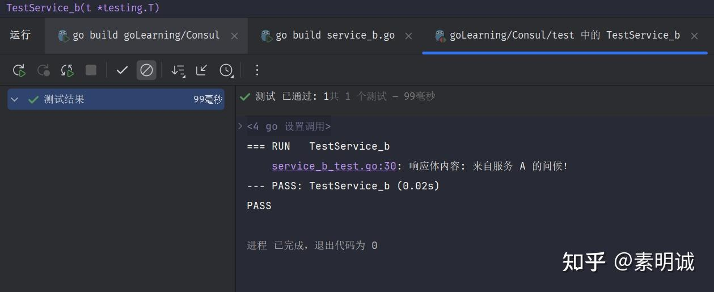

# Consul 功能详解实践，服务注册和发现案例

## 服务发现

服务实例在启动时向 Consul 注册其详细信息（如服务名、IP、端口），并通过 Consul 查询其他服务的详细信息，实现动态发现和连接。

**定期健康检查**：配置健康检查确保仅健康实例被发现。

**服务标签**：利用标签对服务进行分类，便于管理和过滤。

## 健康检查

可以设置多种类型的健康检查，如 HTTP、TCP、Docker 或自定义脚本，以验证服务状态。

**精细的检查间隔**：根据服务的重要程度调整检查频率。你的服务挂了超过多久自动删除

## 键值存储

通过 Consul 的 HTTP API 进行键值对的读写操作，存储配置数据或其他共享数据。

**动态配置更新**：利用键值存储动态更新配置，无需重启服务。

**数据一致性**：使用 Consul 的事务功能确保关键配置的一致性更新。

## 多数据中心支持

Consul 允许配置跨多个地理区域的服务同步和状态共享，每个数据中心都可以独立运行，同时与其他数据中心保持同步。

**地理特定的健康检查**：每个数据中心应有针对性的健康检查策略。

**加密通信**：确保所有数据中心间的通信经过加密，保护数据安全。

## 服务发现和注册案例

启动 A 和 B 两个服务之前需要保证 Consul 是正常运行的，并且 Consul 和服务直接的网络是相通的

### 配置文件

```
consul:
  address: "http://172.22.220.64"
  port: "8500"
```

### 服务 a

```
package Consul
​
import (
    "github.com/gin-gonic/gin"
    "github.com/hashicorp/consul/api"
    "github.com/spf13/viper"
    "log"
    "net/http"
)
​
func init() {
    viper.SetConfigFile("./Consul/config.yaml")
    err := viper.ReadInConfig() // 查找并读取配置文件
    if err != nil {             // 处理读取配置文件的错误
        log.Fatalf("致命错误: 配置文件读取失败: %s \n", err)
    }
}
​
func main() {
​
    // 创建 Consul 客户端
    consulConfig := api.DefaultConfig()
    consulConfig.Address = viper.GetString("consul.address") + ":" + viper.GetString("consul.port")
    consulClient, err := api.NewClient(consulConfig)
    if err != nil {
        log.Fatalf("创建 Consul 客户端时发生错误: %s", err)
    }
​
    // 注册服务
    registration := &api.AgentServiceRegistration{
        ID:      "serviceA",
        Name:    "service-a",
        Address: "172.16.50.251",
        Port:    8080,
        Check: &api.AgentServiceCheck{
            HTTP:                           "http://172.16.50.251:8080/health",
            Interval:                       "10s",
            DeregisterCriticalServiceAfter: "1m",
        },
    }
    err = consulClient.Agent().ServiceRegister(registration)
    if err != nil {
        log.Fatalf("向 Consul 注册服务 A 时发生错误: %s", err)
    }
​
    // 设置 Gin 路由
    r := gin.Default()
    r.GET("/health", func(c *gin.Context) {
        c.Status(http.StatusOK)
    })
    r.GET("/data", func(c *gin.Context) {
        c.String(http.StatusOK, "来自服务 A 的问候！")
    })
​
    // 启动 HTTP 服务器
    log.Println("服务 A 正在端口 8080 上运行")
    r.Run(":8080")
}
​

```

### 服务 b

```
package Consul
​
import (
    "github.com/gin-gonic/gin"
    "github.com/hashicorp/consul/api"
    "github.com/spf13/viper"
    "io/ioutil"
    "log"
    "net/http"
    "strconv"
)
​
func init() {
    viper.SetConfigFile("./Consul/config.yaml")
    err := viper.ReadInConfig()
    if err != nil {
        log.Fatalf("致命错误: 配置文件读取失败: %s \n", err)
    }
}
​
func main() {
    // 创建 Consul 客户端
    consulConfig := api.DefaultConfig()
    consulConfig.Address = viper.GetString("consul.address") + ":" + viper.GetString("consul.port")
    consulClient, err := api.NewClient(consulConfig)
    if err != nil {
        log.Fatalf("创建 Consul 客户端时发生错误: %s", err)
    }
​
    // 注册服务
    registration := &api.AgentServiceRegistration{
        ID:      "serviceB",
        Name:    "service-b",
        Address: "172.16.50.251",
        Port:    8081,
        Check: &api.AgentServiceCheck{
            HTTP:                           "http://172.16.50.251:8081/health",
            Interval:                       "10s",
            DeregisterCriticalServiceAfter: "1m",
        },
    }
    err = consulClient.Agent().ServiceRegister(registration)
    if err != nil {
        log.Fatalf("向 Consul 注册服务 B 时发生错误: %s", err)
    }
​
    // 设置 Gin 路由
    r := gin.Default()
    r.GET("/health", func(c *gin.Context) {
        c.Status(http.StatusOK)
    })
    r.GET("/call-a", func(c *gin.Context) {
        // 发现服务 A 并调用其 API
        services, _, err := consulClient.Health().Service("service-a", "", true, nil)
        if err != nil {
            c.String(http.StatusInternalServerError, "从 Consul 获取服务时发生错误")
            return
        }
        if len(services) > 0 {
            serviceA := services[0].Service
            url := "http://" + serviceA.Address + ":" + strconv.Itoa(serviceA.Port) + "/data"
            resp, err := http.Get(url)
            if err != nil {
                c.String(http.StatusInternalServerError, "调用服务 A 时发生错误")
                return
            }
            defer resp.Body.Close()
            body, err := ioutil.ReadAll(resp.Body)
            if err != nil {
                c.String(http.StatusInternalServerError, "读取服务 A 响应时发生错误")
                return
            }
            c.String(http.StatusOK, string(body))
        } else {
            c.String(http.StatusNotFound, "未找到服务 A")
        }
    })
​
    // 启动 HTTP 服务器
    log.Println("服务 B 正在端口 8081 上运行")
    r.Run(":8081")
}
​

```

## 测试

```
package test
​
import (
    "io/ioutil"
    "net/http"
    "testing"
)
​
func TestService_b(t *testing.T) {
    // 直接发起对服务 A 的 GET 请求
    resp, err := http.Get("http://172.16.50.251:8081/call-a")
    if err != nil {
        t.Fatal("创建请求失败:", err)
    }
    defer resp.Body.Close()
​
    // 检查状态码
    if resp.StatusCode != http.StatusOK {
        t.Errorf("期望的状态码 200，但是获取的是 %d", resp.StatusCode)
    }
​
    // 读取响应体
    bodyBytes, err := ioutil.ReadAll(resp.Body)
    if err != nil {
        t.Fatal("读取响应体失败:", err)
    }
    body := string(bodyBytes)
​
    // 打印响应体内容
    t.Logf("响应体内容: %s", body)
}
​

```



求个赞
