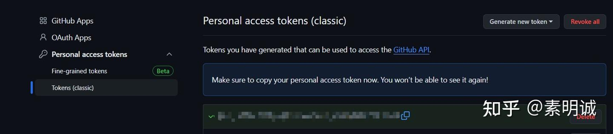
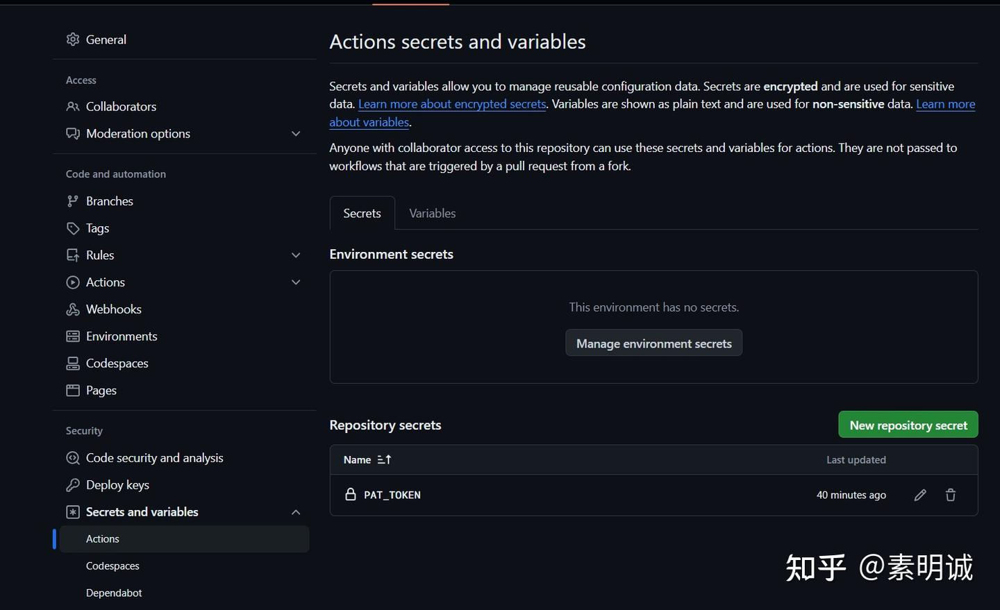
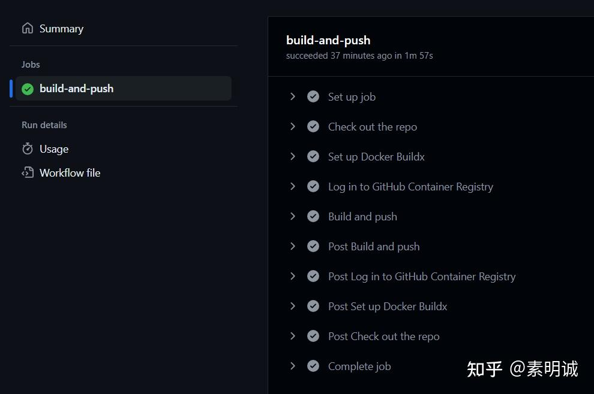
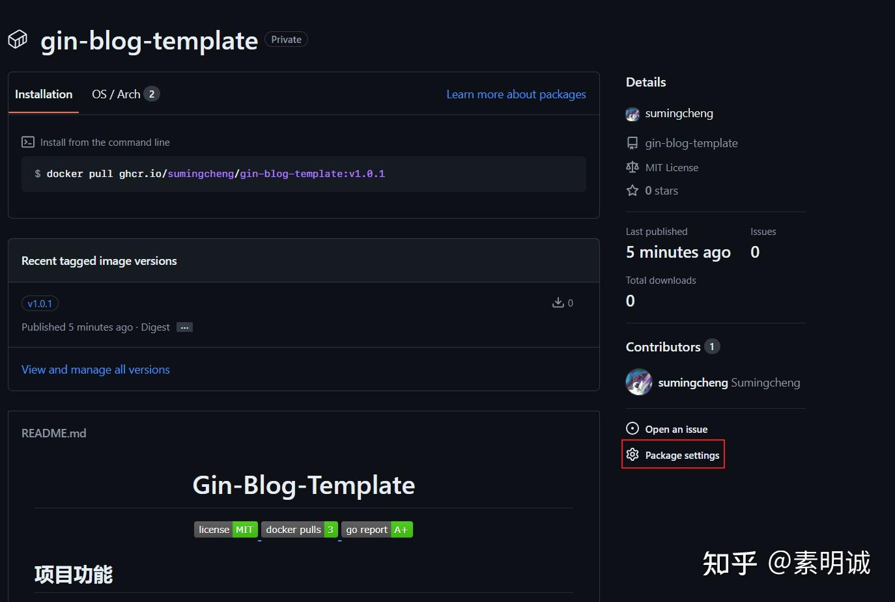
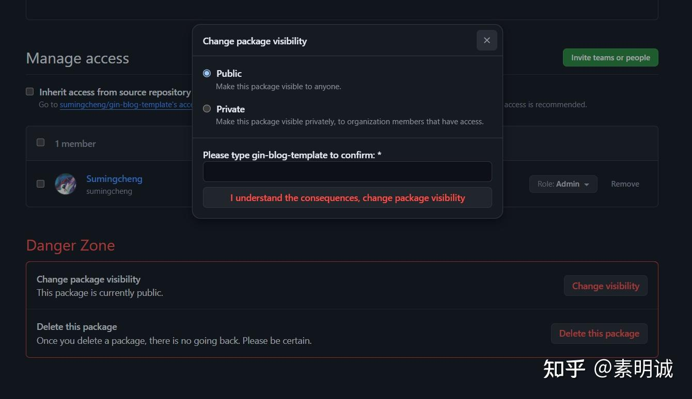
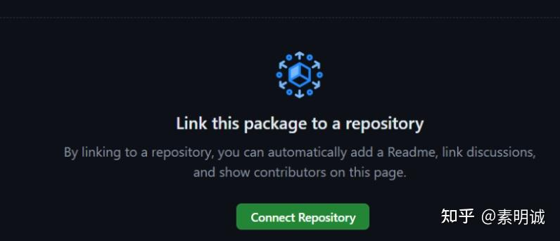
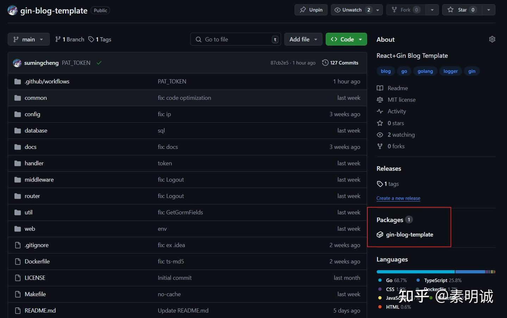

# 发布 Docker 镜像到 GitHub Packages


 **Link:** [https://zhuanlan.zhihu.com/p/710446108]

## 1.准备你的项目  

确保你的项目包含所有必需的文件，例如`Dockerfile`（对于 Docker 镜像）、并且你已经在本地测试镜像构建成功。

确定你的项目结构，你的`Dockerfile`支持版本控制。

## 2.配置 GitHub Actions  
### 创建工作流文件  

**在你的 GitHub 仓库中的 `.github/workflows` 目录下创建一个 YAML 工作流文件。**

```
name: Publish Docker image
​
on:
  push:
    branches:
      - main
    tags:
      - 'v*'
​
jobs:
  build-and-push:
    runs-on: ubuntu-22.04
    steps:
      - name: Check out the repo
        uses: actions/checkout@v2
​
      - name: Set up Docker Buildx
        uses: docker/setup-buildx-action@v1
​
      - name: Log in to GitHub Container Registry
        uses: docker/login-action@v1
        with:
          registry: ghcr.io
          username: ${{ github.actor }}
          password: ${{ secrets.PAT_TOKEN }}
​
      - name: Build and push
        uses: docker/build-push-action@v2
        with:
          context: .
          file: ./Dockerfile
          push: true
          tags: ghcr.io/${{ github.repository_owner }}/gin-blog-template:${{ github.ref_name }}
          build-args: VERSION=${{ github.ref_name }}
​
```
### 定义触发条件  

配置工作流触发条件，比如在推送到特定分支或创建标签时触发。我配置的是提交`tag`到主分支后触发构建镜像的流程

### 配置环境变量，设置 GitHub Secrets  

这里需要你仓库的一些权限，需要你生成`PAT_TOKEN`确保你有以下权限

* `write:packages` （允许写入包）
* `delete:packages` （可选，允许删除包）
* `repo` （允许访问私有仓库，如果您的仓库是私有的）

### 创建令牌  
### 添加到仓库的环境变量  
### 提交要构建的 tag 并推送  

**创建注释标签**

```
git tag -a v1.0 -m "Release version 1.0"
```

**查看所有标签**

```
git tag
```

**推送标签到远程仓库**

```
git push origin v1.0
```
### 构建成功后你可以看到你的镜像  

[https://github.com/sumingcheng/gin-blog-template/pkgs/container/gin-blog-template](https://github.com/sumingcheng/gin-blog-template/pkgs/container/gin-blog-template)

### 3.设置包的可见性（可选）  

一旦包被推送到 GitHub Packages，你可能需要设置其可见性（公开或私有）。这可以在 GitHub 界面中完成，通过修改包的设置。



修改可见性

  
  


修改为公开的

  
  
### 4.链接到仓库（可选）  

如果需要，你可以将包链接到一个特定的 GitHub 仓库，以便更好地集成和展示。直接链接到你想展示的仓库，创建即可。

### 5.验证和测试  

验证包是否已正确发布到 GitHub Packages，并测试是否可以正常下载和使用。


