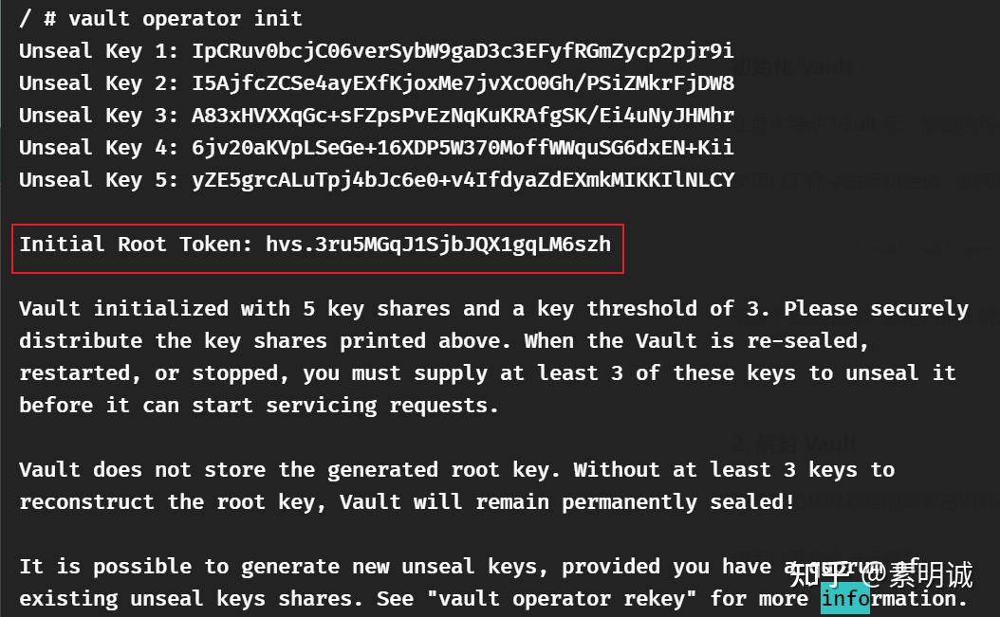
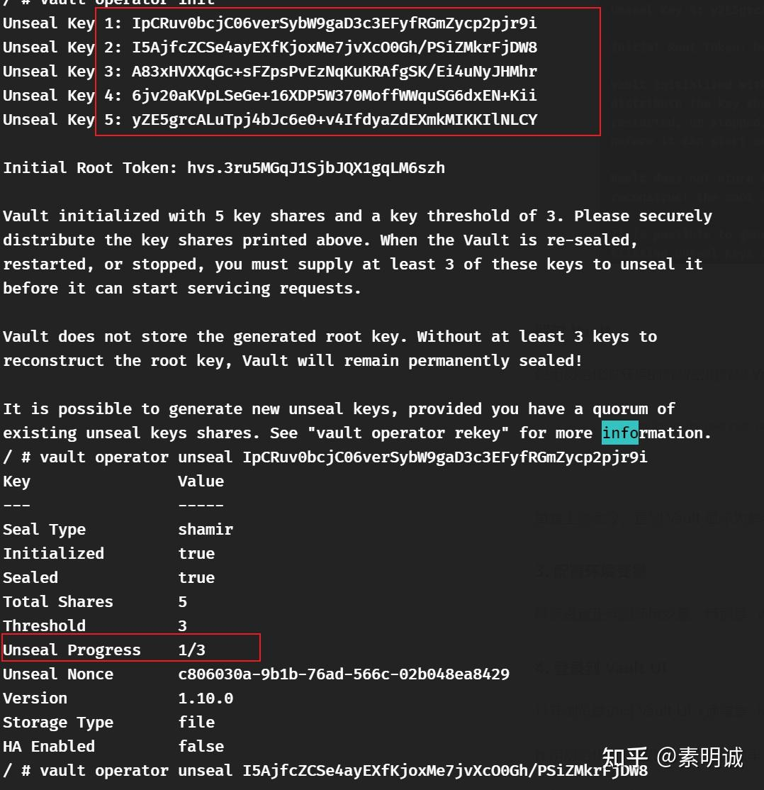

# Vault 初始化与配置


 **Link:** [https://zhuanlan.zhihu.com/p/711464955]

### docker-compose 启动  
[https://github.com/sumingcheng/dev-tools/blob/main/vault/docker-compose.yml](https://github.com/sumingcheng/dev-tools/blob/main/vault/docker-compose.yml)### 初始化 Vault  

在首次启动 Vault 后，需要进行初始化。这个过程会生成解封密钥和根令牌。

使用以下命令进行初始化，也可以进入容器进行初始化

```
docker exec -it vault vault operator init
```

记录下显示的解封密钥和根令牌。这些信息非常重要，必须安全保存。

### 解封 Vault  

使用初始化时获得的解封密钥解封 Vault。需要至少提供初始化时指定的阈值数量的密钥。

```
docker exec -it vault vault operator unseal <Unseal_Key>
```


图片里给了5个KEY，只要使用其中3个即可，重复上述命令，直到 Vault 显示为解封状态。如果docker完全重启的话，可能还需要重新解封。

### 配置环境变量  

确保设置正确的环境变量，特别是 `VAULT_ADDR`，以便您的应用和服务能够正确地与 Vault 通信。

### 登录到 Vault UI  

打开浏览器访问 Vault UI（通常是 `http://IP:8000`）。

使用初始化生成的根令牌登录。如果 Vault UI 配置了默认的 `VAULT_TOKEN_DEFAULT` 令牌并且有效，也可以尝试使用它登录。如果无法登录可以先试使用`root key` 邓肯

### 配置访问控制和策略  

通过 UI 或命令行配置访问控制列表 (ACL) 策略，以定义谁可以访问什么数据。

创建额外的用户和令牌，以便其他系统和用户能够访问 Vault。