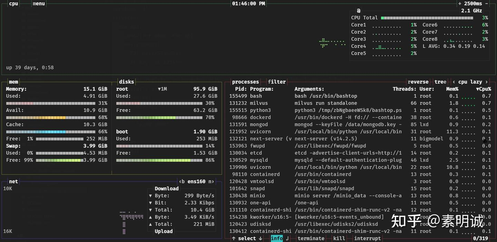

# Linux Bashtop 安装使用指南


 **Link:** [https://zhuanlan.zhihu.com/p/712361591]

## bashtop  
## 安装  
### Ubuntu/Debian  
```
sudo apt install bashtop
```
### CentOS/RHEL  
```
sudo yum install epel-release
sudo yum install bashtop 
```
### Fedora  
```
sudo dnf install bashtop
```
### Arch Linux  
```
sudo pacman -S bashtop
```
### macOS (通过 Homebrew)  
```
brew install bashtop
```
## 使用  

安装完成后,在终端直接运行 `bashtop` 命令即可启动。

```
bashtop
```
### 界面说明  

* CPU 使用率:显示每个 CPU 核心的使用率柱状图
* 内存使用:显示内存和交换空间的使用量
* 磁盘使用:显示挂载的文件系统的使用量
* 网络流量:显示实时的上传和下载流量
* 进程列表:显示当前运行的进程,可以按 CPU 或内存使用排序

### 交互操作  

* `UP/DOWN`:上下移动选择进程
* `PgUP/PgDn`:上下翻页
* `a`:显示所有进程或仅显示活动进程
* `f`:进入进程过滤模式
* `+/-`:调整进程列表刷新间隔
* `q`:退出 bashtop

## 注意事项  

* Bashtop 需要 root 权限才能完整地获取系统信息,因此最好使用 `sudo` 运行
* Bashtop 会消耗一定的系统资源,在资源紧张的服务器上要慎用
* 频繁刷新进程列表可能会增加系统负载,酌情调整刷新间隔