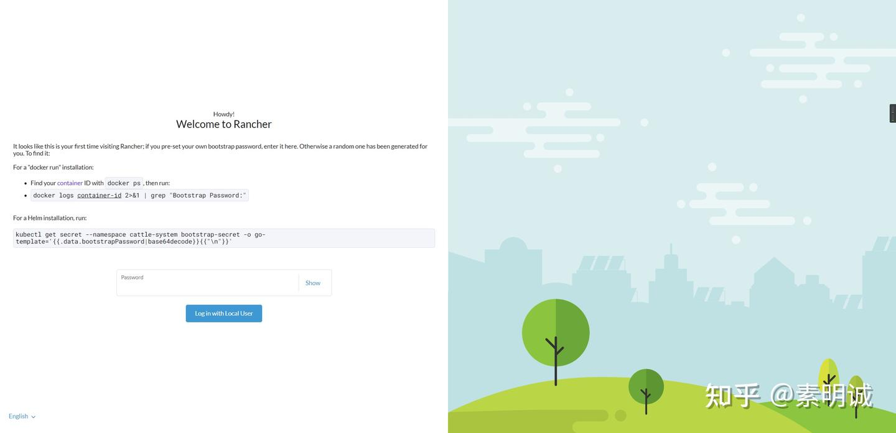
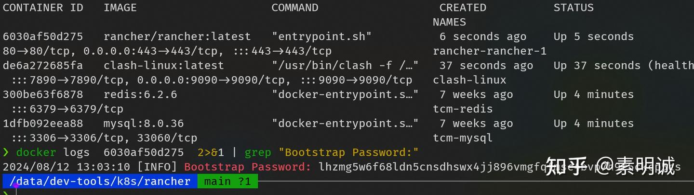
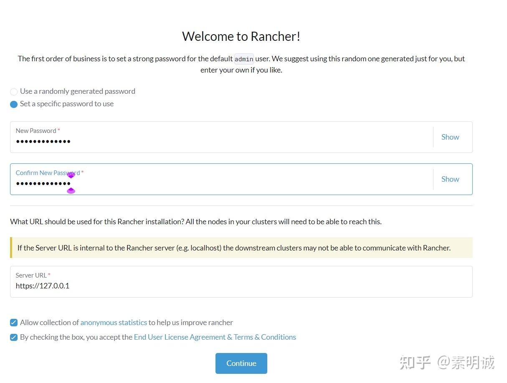
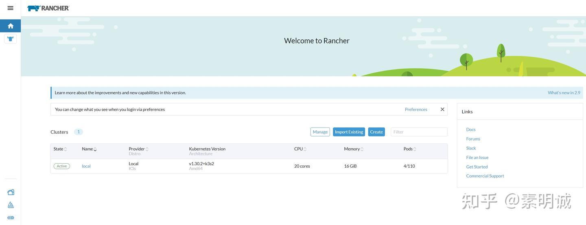
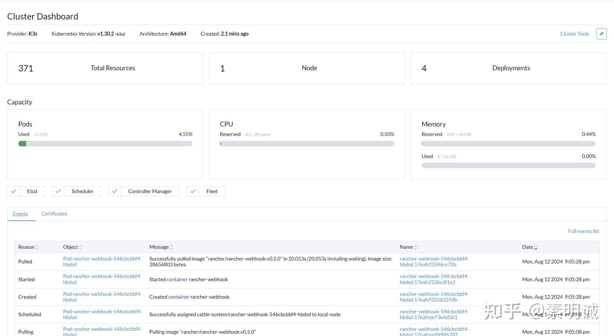

# Linux Rancher 快速配置 K8S


 **Link:** [https://zhuanlan.zhihu.com/p/714135221]

## 下载镜像  
```
rancher/rancher:latest
```
## docker-compose  
```
version: '3'
services:
  rancher:
    image: rancher/rancher:latest
    restart: unless-stopped
    privileged: true
    environment:
      HTTP_PROXY: "http://clash:7890"
      HTTPS_PROXY: "http://clash:7890"
    ports:
      - 80:80
      - 443:443
    volumes:
      - ./rancher-data:/var/lib/rancher
    networks:
      - clash
networks:
  clash:
    external: true
```
## 启动  
```
docker-compose up -d
```


按照提示进行配置

### 记得查看下logger看看是否都成功了  
## 下方的事件列表(Events)详细记录了集群中发生的一系列事件  

* 成功分配 cattle-provisioning-capi-system/capi-controller-manager 资源
* 从镜像仓库拉取 rancher/mirrored-cluster-api-controller 镜像
* 创建和扩容 capi-controller-manager 等Pod
* 启动、创建和拉取容器镜像等操作
