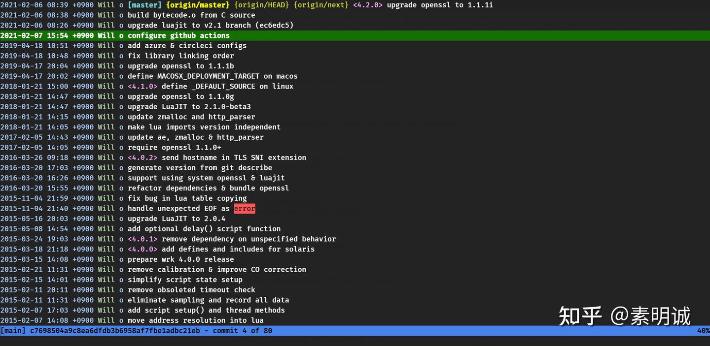
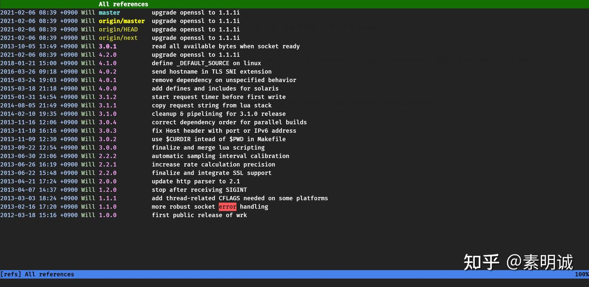
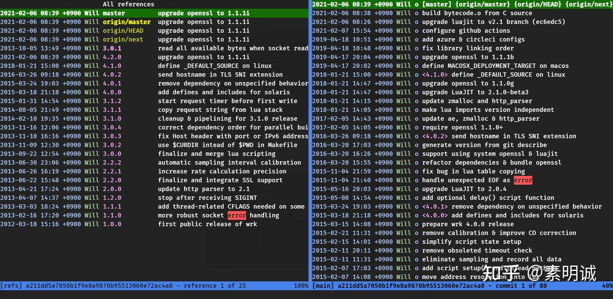
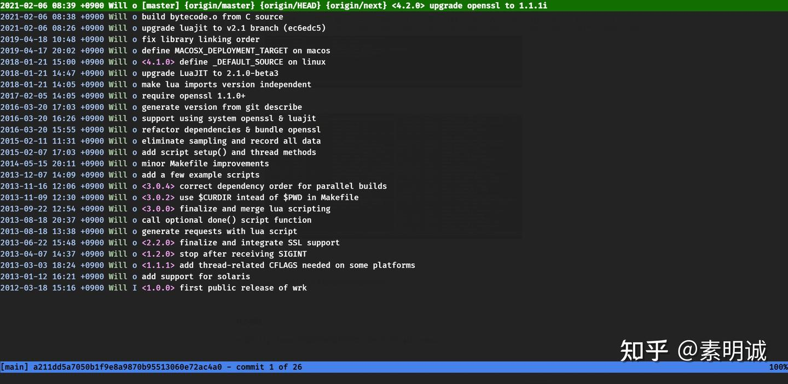
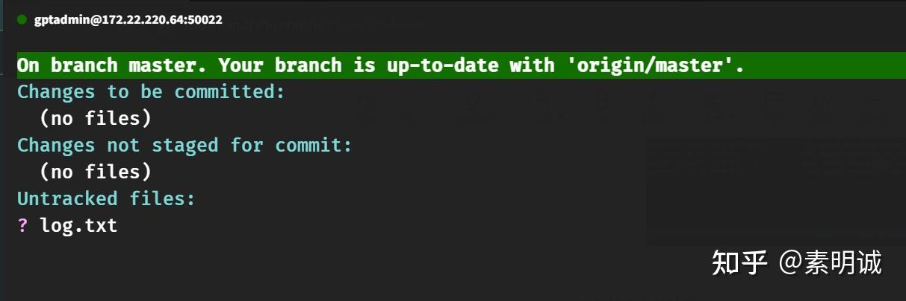
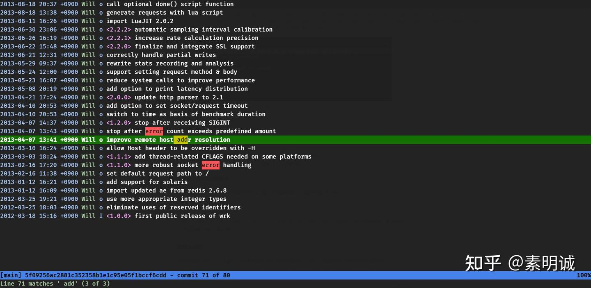
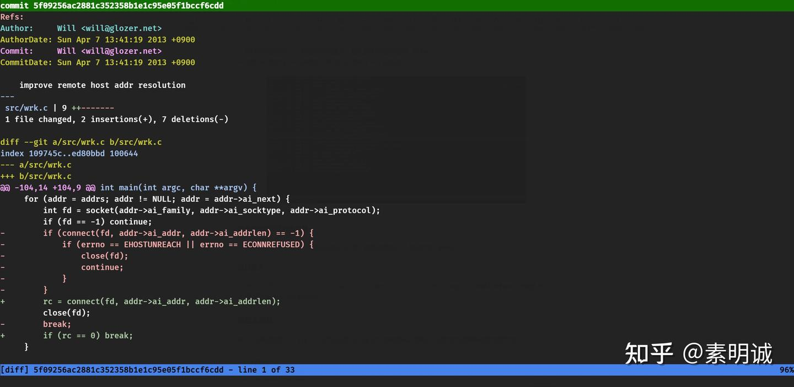

# Linux Tig 使用指南


 

## 安装 Tig  

Tig 可以在大多数 Linux 发行版以及 macOS 上通过包管理器安装。以下是一些常见系统的安装方法

**Ubuntu/Debian**

```
sudo apt-get install tig
```

**Fedora**

```
sudo dnf install tig
```

**macOS** (使用 Homebrew)

```
brew install tig
```

安装完成后，你可以通过在任何 Git 仓库目录下运行 `tig` 命令来启动它。

## 基础使用  

启动 Tig 后，默认视图是当前仓库的提交历史。你将看到每个提交的哈希值、作者、日期和提交消息。

**导航**

* 使用上下箭头键 `↑` 和 `↓` 来在提交列表中上下移动。
* 按 `Enter` 查看选中提交的详细变更内容。



**查看分支和标签**

* 运行 `tig refs` 显示所有的分支和标签。
* 选中任一分支或标签并按 `Enter` 可查看该引用的提交历史。



**查看特定文件的历史**

* 运行 `tig <文件路径>` 可查看指定文件的提交历史。



**状态视图**

* 运行 `tig status` 可查看当前仓库的状态，类似于运行 `git status`。

## 进阶操作  

**搜索**

* 在任何视图中按 `/` 键启动搜索模式，输入搜索关键词后按 `Enter`。
* 使用 `n` 查找下一个匹配项，使用 `N` 查找上一个匹配项。



**查看两个提交之间的差异**

* 在历史视图中，选中一个提交后按 `D` 键，然后选择第二个提交并按 `Enter`。



**过滤提交**

按 `` 键进入命令模式，然后可以输入类似于 Git 命令的过滤器，例如` tig @ -- README.md` 查看涉及 README.md 文件的提交。

### 自定义配置  

你可以通过修改 `~/.tigrc` 文件来自定义 Tig 的行为和样式。例如，添加自定义颜色或改变键绑定。

```
# 设置颜色
set main-author-color yellow
set main-date-color green
​
# 更改键绑定
bind main h select
```