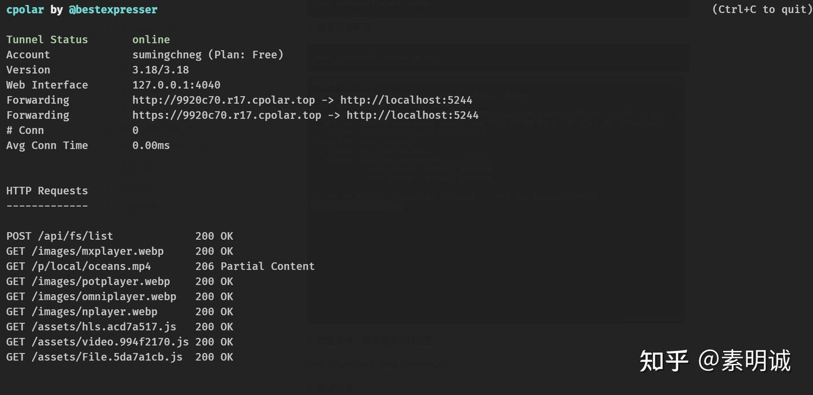
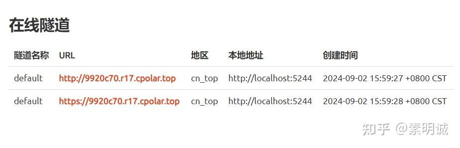

# Cpolar、安装与使用，内网穿透工具推荐

 **Link:** [https://zhuanlan.zhihu.com/p/717842170]

## 文档  
[文档 - cpolar 极点云官网](https://www.cpolar.com/docs)## Linux  

[https://dashboard.cpolar.com/status](https://dashboard.cpolar.com/status)

测试某个应用的时候还是很方便的

  
  
## 其他内网穿透工具  

[https://qq.uusec.com/#/?id=main](https://qq.uusec.com/#/?id=main)

[https://www.openfrp.net/](https://www.openfrp.net/)

[https://chmlfrp.cn/](https://chmlfrp.cn/)

[https://github.com/inconshreveable/ngrok](https://github.com/inconshreveable/ngrok)

## 如果你在意安全问题，建议还是使用 frp  

[https://github.com/fatedier/frp](https://github.com/fatedier/frp)

