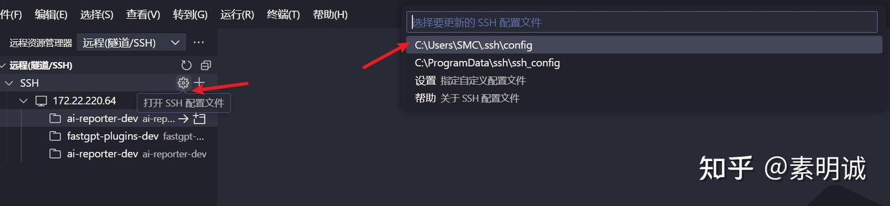

# VSCode SSH开发，免密登录


 **Link:** [https://zhuanlan.zhihu.com/p/718020833]

## 生成SSH密钥对  

打开Git Bash，然后输入以下命令生成一个新的SSH密钥对。如果你生成过了就不要再生了。

```
ssh-keygen -t rsa -b 4096 -C "your_email@example.com"
```

这里的`your_email@example.com`应替换为您的电子邮件地址，用作密钥的标签。按回车接受默认文件位置（通常是`/c/Users/YourUsername/.ssh/id_rsa`），在提示时可以选择输入密码或留空以创建无密码的密钥。

## 将公钥添加到Linux服务器  

**拷贝公钥内容**

在Git Bash中，使用`cat`命令查看并复制您的公钥内容

```
cat ~/.ssh/id_rsa.pub
```

复制输出的所有内容（确保复制完整，包括`ssh-rsa`开头和邮箱结尾）。

**登录到的Linux服务器** 使用用户名和服务器地址登录

```
ssh -p 22 username@server-address
```

替换`username`和`server-address`为您的实际用户名和服务器地址。

**编辑authorized\_keys文件** 在服务器上，将公钥内容添加到`~/.ssh/authorized_keys`文件中。如果文件不存在，可以创建它。

然后把你刚刚复制的内容粘贴进来，保存

```
nano ~/.ssh/authorized_keys
```

**设置权限** 设置正确的文件权限以确保安全

```
chmod 700 ~/.ssh
chmod 600 ~/.ssh/authorized_keys
```
## 配置VSCode进行远程开发  


在`VSCode`内添加`IdentityFile ~/.ssh/id_rsa`。这可以进一步简化您的SSH连接命令

```
Host example
    HostName example.com
    User username
    IdentityFile ~/.ssh/id_rsa
```
