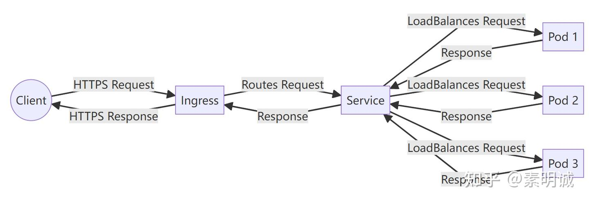
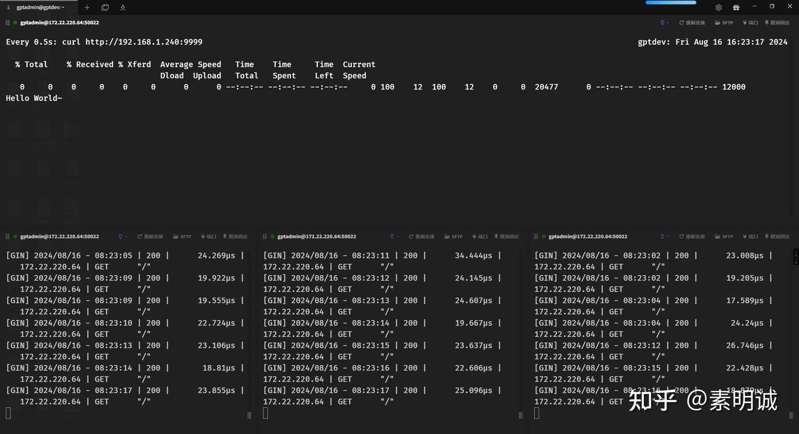
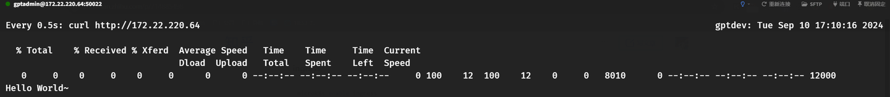

# Microk8s 单机集群上的服务负载均衡实践


 **Link:** [https://zhuanlan.zhihu.com/p/714885498]

## 部署结构  
## 安装 microk8s  
[素明诚：Ubuntu 安装 MicroK8s](https://zhuanlan.zhihu.com/p/714822990)## 配置 microk8s  
### 安装插件  

MetalLB: 这是一个负载均衡器实现,可以为 Kubernetes 服务提供外部 IP 地址。在裸机 Kubernetes 集群(如单节点 Microk8s 集群)中,MetalLB 通常用来替代云平台上的负载均衡服务。

Ingress: Ingress 是一种 Kubernetes 资源,用于管理从集群外部到集群内服务的访问。它可以提供 SSL 终止、基于名称的虚拟主机等功能。

### metallb  

安装时候输入你的想要地址段`192.168.1.240-192.168.1.250`

```
microk8s enable metallb
```

查看是否正常

```
microk8s kubectl get pods -n metallb-system
```
### ingress  
```
microk8s enable ingress
```
### 测试  
```
watch -n 0.5 curl http://192.168.1.240:9999
```
## 负载均衡效果  


service

  
  


ingress

  
  
## 配置文件  
## deployment.yaml  
```
apiVersion: apps/v1
kind: Deployment
metadata:
  name: go-sec-kill
spec:
  replicas: 3
  selector:
    matchLabels:
      app: go-sec-kill
  template:
    metadata:
      labels:
        app: go-sec-kill
    spec:
      containers:
        - name: go-sec-kill
          image: smcroot/go-sec-kill
          ports:
            - containerPort: 8080
          imagePullPolicy: IfNotPresent
          resources:
            requests:
              memory: "1Gi" # 请求1GB内存
              cpu: "500m" # 请求0.5 CPU
            limits:
              memory: "2Gi" # 限制最多使用2GB内存
              cpu: "1" # 限制最多使用1个CPU
​
```
## service.yaml  
```
apiVersion: v1
kind: Service
metadata:
  name: go-sec-kill
spec:
  type: LoadBalancer
  selector:
    app: go-sec-kill
  ports:
    - protocol: TCP
      name: http
      port: 9999
      targetPort: 8080
```
## ingress.yaml  
```
apiVersion: networking.k8s.io/v1
kind: Ingress
metadata:
  name: go-sec-kill-ingress
spec:
  rules:
    - http:
        paths:
          - path: /
            pathType: Prefix
            backend:
              service:
                name: go-sec-kill
                port:
                  number: 9999
```
## ipaddresspool.yaml  
```
apiVersion: metallb.io/v1beta1
kind: IPAddressPool
metadata:
  name: my-ip-pool
  namespace: metallb-system
spec:
  addresses:
    - 192.168.1.240-192.168.1.250
```
