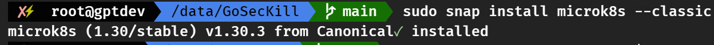
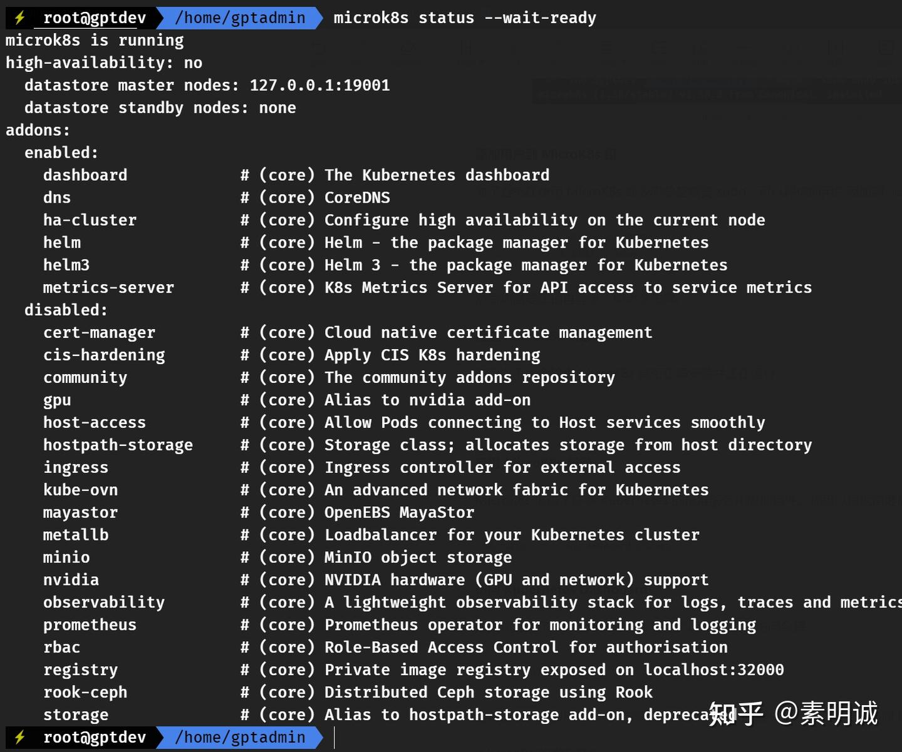
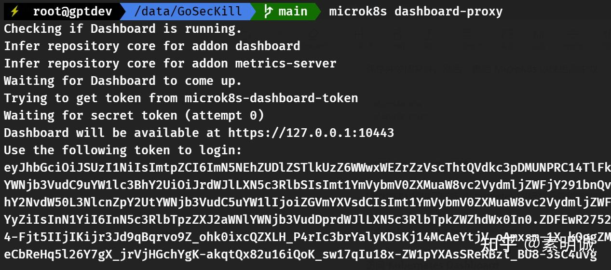

# Ubuntu 安装 MicroK8s


 **Link:** [https://zhuanlan.zhihu.com/p/714822990]

## 安装 MicroK8s  

MicroK8s 是通过 Snap 包提供的，因此确保你的系统支持 Snap 包。在 Ubuntu 上，Snap 通常已经预安装。

**安装 MicroK8s**

```
sudo snap install microk8s --classic
```

`--classic` 标志表示允许 Snap 包访问系统的更多资源。



安装成功

  
  
### 卸载  
```
sudo snap remove microk8s --purge
```

**添加用户到 MicroK8s 组**

为了避免在使用 MicroK8s 命令时总是需要 sudo，可以将你的用户添加到 `microk8s` 组

```
sudo usermod -a -G microk8s $USER
sudo chown -f -R $USER ~/.kube
```

然后你需要注销再登录，使更改生效。

**检查 MicroK8s 状态**

使用以下命令检查 MicroK8s 是否正确安装并正在运行

```
microk8s status --wait-ready
```


**如果没有看到正常输出，或者卡住，大概率是网络问题。你需要配置代理**

### 配置 MicroK8s 代理  

为了确保 MicroK8s 内部的 Kubernetes 组件也能使用代理，你可以修改 MicroK8s 的服务定义，添加环境变量。MicroK8s 使用 systemd 服务管理其组件，因此你可以直接修改这些服务文件：

```
sudo nano /var/snap/microk8s/current/args/containerd-env
```

在该文件内添加以下行，换成你的代理地址

```
export HTTP_PROXY=http://172.22.220.64:7890
export HTTPS_PROXY=http://172.22.220.64:7890
export NO_PROXY=localhost,127.0.0.1,.cluster.local
```

保存并关闭文件。然后，重启 MicroK8s 以使更改生效

```
microk8s stop
microk8s start
```
## 启用 MicroK8s 服务  

MicroK8s 提供了许多 Kubernetes 的标准服务和附加组件。你可以根据需要启用

**DNS**: DNS 插件是 Kubernetes 集群中的核心，负责在集群内部提供名称解析服务，使得 Pods 能够通过服务名而非 IP 地址相互通信。

**Dashboard**: Kubernetes Dashboard 提供了一个基于 Web 的用户界面，允许用户直观地管理和监控集群中的资源，如 Pods 和 Deployments。

**Storage**: 存储插件允许在 Kubernetes 集群中配置持久化存储解决方案，支持如持久卷（Persistent Volumes）等存储资源的使用

```
microk8s enable dns dashboard storage
```

**访问 Kubernetes Dashboard**

如果你启用了 dashboard，可以通过以下命令获取访问令牌

```
microk8s dashboard-proxy
```
## 标准的kubectl命令而不是每次都键入microk8s kubectl  
### 1. 修改别名  
```
nano ~/.bashrc  # 或者 ~/.zshrc，取决于你使用的 shell
# 在文件的末尾添加以下行
alias kubectl='microk8s kubectl'
# 保存并关闭文件，然后重新加载配置
source ~/.bashrc  # 或者 source ~/.zshrc
```
### 2. 使用 Bash 中的>操作符来强制覆盖  
```
microk8s config > ~/.kube/config
```
## 参考文档  

MicroK8s 的[https://microk8s.io/docs](https://microk8s.io/docs)

