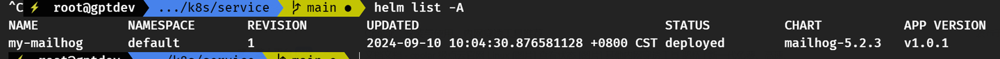

# 安装 Helm 配置代理


 

## 安装Helm  

如果你使用的是Ubuntu或者其他基于Debian的系统，建议通过`snap`安装`Helm`

```
sudo snap install helm --classic
```

安装完成后，你可以通过以下命令验证`Helm`是否正确安装

```
helm version
```

如果你使用的是其他Linux发行版或操作系统，也可以直接从官方获取`Helm`。以下是通用的安装步骤

### 通过脚本安装Helm  

你可以使用Helm官方提供的安装脚本

```
curl https://raw.githubusercontent.com/helm/helm/main/scripts/get-helm-3 | bash
```
## 手动安装Helm  

你也可以从[https://helm.sh/docs/intro/install/](https://helm.sh/docs/intro/install/)下载适合你操作系统的二进制文件，并将其添加到系统的PATH中。

## 安装完成后操作  

安装`helm`后，列出已安装的Helm releases

```
helm list -A
```

注意！如果你没有使用 `Helm` 来部署 Kubernetes 应用程序，`helm list -A` 命令将不会显示任何内容

## 使用国内 Helm 仓库镜像  

在中国使用 Helm 时，最常见的做法是使用国内的 Helm 仓库镜像，以加快访问速度。可以添加国内的 Helm 镜像源，比如阿里云的 Helm 仓库。

**阿里云 Helm 仓库**

```
helm repo add aliyun https://apphub.aliyuncs.com
```
## 配置 HTTP/HTTPS 代理  

配置系统的 HTTP/HTTPS 代理，Helm 会自动使用这些代理来访问网络。

在命令行环境中设置代理

```
export http_proxy=http://172.22.220.64:7096
export https_proxy=http://172.22.220.64:7096
```