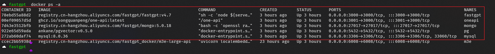

# FastGPT4.7 + chatglm3-6b + m3e 本地部署


 **Link:** [https://zhuanlan.zhihu.com/p/692766036]

## 安装 Docker 和 docker-compose  

Windows 可以使用 wsl

```
# 安装 Docker
curl -fsSL https://get.docker.com | bash -s docker --mirror Aliyun
systemctl enable --now docker
# 安装 docker-compose
curl -L https://github.com/docker/compose/releases/download/v2.20.3/docker-compose-`uname -s`-`uname -m` -o /usr/local/bin/docker-compose
chmod +x /usr/local/bin/docker-compose
# 验证安装
docker -v
docker-compose -v
```
## 安装并启动  

docker-compose.yml 和 config.json 这两个文件很重要，安装后不要删掉~

```
mkdir fastgpt
cd fastgpt
curl -O https://raw.githubusercontent.com/labring/FastGPT/main/files/deploy/fastgpt/docker-compose.yml
curl -O https://raw.githubusercontent.com/labring/FastGPT/main/projects/app/data/config.json
```

注意启动的时候要在 fastgpt 这个目录

```
# 启动容器
docker-compose up -d
# 等待10s，OneAPI第一次总是要重启几次才能连上Mysql
sleep 10
# 重启一次oneapi(由于OneAPI的默认Key有点问题，不重启的话会提示找不到渠道，临时手动重启一次解决，等待作者修复)
docker restart oneapi
```


安装成功后可以看到红框里的容器，m3e后续再说

  
  
### 服务说明  

OneAPI：提供标准的API格式，后续M3E和GLM都要对接到这里面

FastGPT：NextJS做的，提供前端和后端的服务

mongo：聊天记录、历史对话等数据

pg：存向量

MySQL：\_

M3E：向量化模型

## 运行 chatglm3-6b  
[https://github.com/THUDM/ChatGLM3](https://github.com/THUDM/ChatGLM3)

克隆项目后，我们安装依赖，记得装CUDA驱动。

我们需要的就是openai\_api\_demo里面的[https://github.com/THUDM/ChatGLM3/blob/main/openai\_api\_demo/api\_server.py](https://github.com/THUDM/ChatGLM3/blob/main/openai\_api\_demo/api\_server.py)

这里需要注意的是，你可以选择提前下载好模型，或者是运行的时候再下载，提前下载可能会快很多~

glm3-6b，这个比较好运行，网上教程非常多，只要跑起来就可以，这里不赘述了


注意是GLM3的不要 下载错了

  
  
### api\_server.py  

这里给出来，修改了一下前面的路径，因为我已经提前下载好了模型

```
import os
import time
import tiktoken
import torch
import uvicorn

from fastapi import FastAPI, HTTPException, Response
from fastapi.middleware.cors import CORSMiddleware

from contextlib import asynccontextmanager
from typing import List, Literal, Optional, Union
from loguru import logger
from pydantic import BaseModel, Field
from transformers import AutoTokenizer, AutoModel
from utils import process_response, generate_chatglm3, generate_stream_chatglm3
from sentence_transformers import SentenceTransformer

from sse_starlette.sse import EventSourceResponse


print(torch.__version__)
print(torch.cuda.is_available())

# Set up limit request time
EventSourceResponse.DEFAULT_PING_INTERVAL = 1000

# 获取当前脚本的目录
current_dir = os.path.dirname(os.path.abspath(__file__))

# 构建相对于当前脚本的模型目录路径
model_dir = os.path.abspath(os.path.join(current_dir, "..", "..", "chatglm3-6b"))

print(f"model_dir: {model_dir}")

# 设置环境变量
os.environ['MODEL_PATH'] = model_dir
os.environ['TOKENIZER_PATH'] = model_dir

print("MODEL_PATH:", os.getenv('MODEL_PATH'))
print("TOKENIZER_PATH:", os.getenv('TOKENIZER_PATH'))

# set LLM path
MODEL_PATH = os.environ.get('MODEL_PATH', 'THUDM/chatglm3-6b')
TOKENIZER_PATH = os.environ.get("TOKENIZER_PATH", MODEL_PATH)

# set Embedding Model path
EMBEDDING_PATH = os.environ.get('EMBEDDING_PATH', 'BAAI/bge-m3')


@asynccontextmanager
async def lifespan(app: FastAPI):
    yield
    if torch.cuda.is_available():
        torch.cuda.empty_cache()
        torch.cuda.ipc_collect()


app = FastAPI(lifespan=lifespan)

app.add_middleware(
    CORSMiddleware,
    allow_origins=["*"],
    allow_credentials=True,
    allow_methods=["*"],
    allow_headers=["*"],
)


class ModelCard(BaseModel):
    id: str
    object: str = "model"
    created: int = Field(default_factory=lambda: int(time.time()))
    owned_by: str = "owner"
    root: Optional[str] = None
    parent: Optional[str] = None
    permission: Optional[list] = None


class ModelList(BaseModel):
    object: str = "list"
    data: List[ModelCard] = []


class FunctionCallResponse(BaseModel):
    name: Optional[str] = None
    arguments: Optional[str] = None


class ChatMessage(BaseModel):
    role: Literal["user", "assistant", "system", "function"]
    content: str = None
    name: Optional[str] = None
    function_call: Optional[FunctionCallResponse] = None


class DeltaMessage(BaseModel):
    role: Optional[Literal["user", "assistant", "system"]] = None
    content: Optional[str] = None
    function_call: Optional[FunctionCallResponse] = None


## for Embedding
class EmbeddingRequest(BaseModel):
    input: Union[List[str], str]
    model: str


class CompletionUsage(BaseModel):
    prompt_tokens: int
    completion_tokens: int
    total_tokens: int


class EmbeddingResponse(BaseModel):
    data: list
    model: str
    object: str
    usage: CompletionUsage


# for ChatCompletionRequest

class UsageInfo(BaseModel):
    prompt_tokens: int = 0
    total_tokens: int = 0
    completion_tokens: Optional[int] = 0


class ChatCompletionRequest(BaseModel):
    model: str
    messages: List[ChatMessage]
    temperature: Optional[float] = 0.8
    top_p: Optional[float] = 0.8
    max_tokens: Optional[int] = None
    stream: Optional[bool] = False
    tools: Optional[Union[dict, List[dict]]] = None
    repetition_penalty: Optional[float] = 1.1


class ChatCompletionResponseChoice(BaseModel):
    index: int
    message: ChatMessage
    finish_reason: Literal["stop", "length", "function_call"]


class ChatCompletionResponseStreamChoice(BaseModel):
    delta: DeltaMessage
    finish_reason: Optional[Literal["stop", "length", "function_call"]]
    index: int


class ChatCompletionResponse(BaseModel):
    model: str
    id: str
    object: Literal["chat.completion", "chat.completion.chunk"]
    choices: List[Union[ChatCompletionResponseChoice, ChatCompletionResponseStreamChoice]]
    created: Optional[int] = Field(default_factory=lambda: int(time.time()))
    usage: Optional[UsageInfo] = None


@app.get("/health")
async def health() -> Response:
    """Health check."""
    return Response(status_code=200)


@app.post("/v1/embeddings", response_model=EmbeddingResponse)
async def get_embeddings(request: EmbeddingRequest):
    if isinstance(request.input, str):
        embeddings = [embedding_model.encode(request.input)]
    else:
        embeddings = [embedding_model.encode(text) for text in request.input]
    embeddings = [embedding.tolist() for embedding in embeddings]

    def num_tokens_from_string(string: str) -> int:
        """
        Returns the number of tokens in a text string.
        use cl100k_base tokenizer
        """
        encoding = tiktoken.get_encoding('cl100k_base')
        num_tokens = len(encoding.encode(string))
        return num_tokens

    response = {
        "data": [
            {
                "object": "embedding",
                "embedding": embedding,
                "index": index
            }
            for index, embedding in enumerate(embeddings)
        ],
        "model": request.model,
        "object": "list",
        "usage": CompletionUsage(
            prompt_tokens=sum(len(text.split()) for text in request.input),
            completion_tokens=0,
            total_tokens=sum(num_tokens_from_string(text) for text in request.input),
        )
    }
    return response


@app.get("/v1/models", response_model=ModelList)
async def list_models():
    model_card = ModelCard(
        id="chatglm3-6b"
    )
    return ModelList(
        data=[model_card]
    )


@app.post("/v1/chat/completions", response_model=ChatCompletionResponse)
async def create_chat_completion(request: ChatCompletionRequest):
    global model, tokenizer

    if len(request.messages) < 1 or request.messages[-1].role == "assistant":
        raise HTTPException(status_code=400, detail="Invalid request")

    gen_params = dict(
        messages=request.messages,
        temperature=request.temperature,
        top_p=request.top_p,
        max_tokens=request.max_tokens or 1024,
        echo=False,
        stream=request.stream,
        repetition_penalty=request.repetition_penalty,
        tools=request.tools,
    )
    logger.debug(f"==== request ====\n{gen_params}")

    if request.stream:

        # Use the stream mode to read the first few characters, if it is not a function call, direct stram output
        predict_stream_generator = predict_stream(request.model, gen_params)
        output = next(predict_stream_generator)
        if not contains_custom_function(output):
            return EventSourceResponse(predict_stream_generator, media_type="text/event-stream")

        # Obtain the result directly at one time and determine whether tools needs to be called.
        logger.debug(f"First result output：\n{output}")

        function_call = None
        if output and request.tools:
            try:
                function_call = process_response(output, use_tool=True)
            except:
                logger.warning("Failed to parse tool call")

        # CallFunction
        if isinstance(function_call, dict):
            function_call = FunctionCallResponse(**function_call)

            """
            In this demo, we did not register any tools.
            You can use the tools that have been implemented in our `tools_using_demo` and implement your own streaming tool implementation here.
            Similar to the following method:
                function_args = json.loads(function_call.arguments)
                tool_response = dispatch_tool(tool_name: str, tool_params: dict)
            """
            tool_response = ""

            if not gen_params.get("messages"):
                gen_params["messages"] = []

            gen_params["messages"].append(ChatMessage(
                role="assistant",
                content=output,
            ))
            gen_params["messages"].append(ChatMessage(
                role="function",
                name=function_call.name,
                content=tool_response,
            ))

            # Streaming output of results after function calls
            generate = predict(request.model, gen_params)
            return EventSourceResponse(generate, media_type="text/event-stream")

        else:
            # Handled to avoid exceptions in the above parsing function process.
            generate = parse_output_text(request.model, output)
            return EventSourceResponse(generate, media_type="text/event-stream")

    # Here is the handling of stream = False
    response = generate_chatglm3(model, tokenizer, gen_params)

    # Remove the first newline character
    if response["text"].startswith("\n"):
        response["text"] = response["text"][1:]
    response["text"] = response["text"].strip()

    usage = UsageInfo()
    function_call, finish_reason = None, "stop"
    if request.tools:
        try:
            function_call = process_response(response["text"], use_tool=True)
        except:
            logger.warning("Failed to parse tool call, maybe the response is not a tool call or have been answered.")

    if isinstance(function_call, dict):
        finish_reason = "function_call"
        function_call = FunctionCallResponse(**function_call)

    message = ChatMessage(
        role="assistant",
        content=response["text"],
        function_call=function_call if isinstance(function_call, FunctionCallResponse) else None,
    )

    logger.debug(f"==== message ====\n{message}")

    choice_data = ChatCompletionResponseChoice(
        index=0,
        message=message,
        finish_reason=finish_reason,
    )
    task_usage = UsageInfo.model_validate(response["usage"])
    for usage_key, usage_value in task_usage.model_dump().items():
        setattr(usage, usage_key, getattr(usage, usage_key) + usage_value)

    return ChatCompletionResponse(
        model=request.model,
        id="",  # for open_source model, id is empty
        choices=[choice_data],
        object="chat.completion",
        usage=usage
    )


async def predict(model_id: str, params: dict):
    global model, tokenizer

    choice_data = ChatCompletionResponseStreamChoice(
        index=0,
        delta=DeltaMessage(role="assistant"),
        finish_reason=None
    )
    chunk = ChatCompletionResponse(model=model_id, id="", choices=[choice_data], object="chat.completion.chunk")
    yield "{}".format(chunk.model_dump_json(exclude_unset=True))

    previous_text = ""
    for new_response in generate_stream_chatglm3(model, tokenizer, params):
        decoded_unicode = new_response["text"]
        delta_text = decoded_unicode[len(previous_text):]
        previous_text = decoded_unicode

        finish_reason = new_response["finish_reason"]
        if len(delta_text) == 0 and finish_reason != "function_call":
            continue

        function_call = None
        if finish_reason == "function_call":
            try:
                function_call = process_response(decoded_unicode, use_tool=True)
            except:
                logger.warning(
                    "Failed to parse tool call, maybe the response is not a tool call or have been answered.")

        if isinstance(function_call, dict):
            function_call = FunctionCallResponse(**function_call)

        delta = DeltaMessage(
            content=delta_text,
            role="assistant",
            function_call=function_call if isinstance(function_call, FunctionCallResponse) else None,
        )

        choice_data = ChatCompletionResponseStreamChoice(
            index=0,
            delta=delta,
            finish_reason=finish_reason
        )
        chunk = ChatCompletionResponse(
            model=model_id,
            id="",
            choices=[choice_data],
            object="chat.completion.chunk"
        )
        yield "{}".format(chunk.model_dump_json(exclude_unset=True))

    choice_data = ChatCompletionResponseStreamChoice(
        index=0,
        delta=DeltaMessage(),
        finish_reason="stop"
    )
    chunk = ChatCompletionResponse(
        model=model_id,
        id="",
        choices=[choice_data],
        object="chat.completion.chunk"
    )
    yield "{}".format(chunk.model_dump_json(exclude_unset=True))
    yield '[DONE]'


def predict_stream(model_id, gen_params):
    """
    The function call is compatible with stream mode output.
    The first seven characters are determined.
    If not a function call, the stream output is directly generated.
    Otherwise, the complete character content of the function call is returned.
    :param model_id:
    :param gen_params:
    :return:
    """
    output = ""
    is_function_call = False
    has_send_first_chunk = False
    for new_response in generate_stream_chatglm3(model, tokenizer, gen_params):
        decoded_unicode = new_response["text"]
        delta_text = decoded_unicode[len(output):]
        output = decoded_unicode

        # When it is not a function call and the character length is> 7,
        # try to judge whether it is a function call according to the special function prefix
        if not is_function_call and len(output) > 7:

            # Determine whether a function is called
            is_function_call = contains_custom_function(output)
            if is_function_call:
                continue

            # Non-function call, direct stream output
            finish_reason = new_response["finish_reason"]

            # Send an empty string first to avoid truncation by subsequent next() operations.
            if not has_send_first_chunk:
                message = DeltaMessage(
                    content="",
                    role="assistant",
                    function_call=None,
                )
                choice_data = ChatCompletionResponseStreamChoice(
                    index=0,
                    delta=message,
                    finish_reason=finish_reason
                )
                chunk = ChatCompletionResponse(
                    model=model_id,
                    id="",
                    choices=[choice_data],
                    created=int(time.time()),
                    object="chat.completion.chunk"
                )
                yield "{}".format(chunk.model_dump_json(exclude_unset=True))

            send_msg = delta_text if has_send_first_chunk else output
            has_send_first_chunk = True
            message = DeltaMessage(
                content=send_msg,
                role="assistant",
                function_call=None,
            )
            choice_data = ChatCompletionResponseStreamChoice(
                index=0,
                delta=message,
                finish_reason=finish_reason
            )
            chunk = ChatCompletionResponse(
                model=model_id,
                id="",
                choices=[choice_data],
                created=int(time.time()),
                object="chat.completion.chunk"
            )
            yield "{}".format(chunk.model_dump_json(exclude_unset=True))

    if is_function_call:
        yield output
    else:
        yield '[DONE]'


async def parse_output_text(model_id: str, value: str):
    """
    Directly output the text content of value
    :param model_id:
    :param value:
    :return:
    """
    choice_data = ChatCompletionResponseStreamChoice(
        index=0,
        delta=DeltaMessage(role="assistant", content=value),
        finish_reason=None
    )
    chunk = ChatCompletionResponse(model=model_id, id="", choices=[choice_data], object="chat.completion.chunk")
    yield "{}".format(chunk.model_dump_json(exclude_unset=True))

    choice_data = ChatCompletionResponseStreamChoice(
        index=0,
        delta=DeltaMessage(),
        finish_reason="stop"
    )
    chunk = ChatCompletionResponse(model=model_id, id="", choices=[choice_data], object="chat.completion.chunk")
    yield "{}".format(chunk.model_dump_json(exclude_unset=True))
    yield '[DONE]'


def contains_custom_function(value: str) -> bool:
    """
    Determine whether 'function_call' according to a special function prefix.
    For example, the functions defined in "tools_using_demo/tool_register.py" are all "get_xxx" and start with "get_"
    [Note] This is not a rigorous judgment method, only for reference.
    :param value:
    :return:
    """
    return value and 'get_' in value


if __name__ == "__main__":
    # Load LLM
    tokenizer = AutoTokenizer.from_pretrained(os.getenv('TOKENIZER_PATH'), trust_remote_code=True)
    model = AutoModel.from_pretrained(os.getenv('MODEL_PATH'), trust_remote_code=True, device_map="auto").eval()

    # load Embedding
    embedding_model = SentenceTransformer(EMBEDDING_PATH, device="cuda")
    uvicorn.run(app, host='0.0.0.0', port=8888, workers=1)

```
### 运行成功后  
### 安装 M3E  

可以参考官方给出的镜像，这个自己搞容易出问题，直接使用镜像最方便，[https://doc.fastai.site/docs/development/custom-models/m3e/](https://doc.fastai.site/docs/development/custom-models/m3e/)

## 配置 OneAPI  

重点来了，OneAPI 目前这个地方有个坑，你参考这篇文章的时候，[https://doc.fastai.site/docs/development/custom-models/m3e/#接入-one-api](https://doc.fastai.site/docs/development/custom-models/m3e/#接入-one-api)，记得Base URL一定要填写具体的IP地址。

### 我的M3E在WSL里面  
### 我的ChatGLM API 在本机本地运行  
### 测试  

如果响应时间特别长，就是有问题

### 增加 config.json 配置  

这里我直接给出我增加的内容，配置文件说明请看 [https://doc.fastai.site/docs/development/configuration/](https://doc.fastai.site/docs/development/configuration/)

```
{
  "feConfigs": {
    "lafEnv": "https://laf.dev"
  },
  "systemEnv": {
    "openapiPrefix": "fastgpt",
    "vectorMaxProcess": 15,
    "qaMaxProcess": 15,
    "pgHNSWEfSearch": 100
  },
  "llmModels": [
  	{
  	"model": "gpt-3.5-turbo",
  	"name": "gpt-3.5-turbo",
  	"maxContext": 16000,
  	"avatar": "/imgs/model/openai.svg",
  	"maxResponse": 4000,
  	"quoteMaxToken": 13000,
  	"maxTemperature": 1.2,
  	"charsPointsPrice": 0,
  	"censor": false,
  	"vision": false,
  	"datasetProcess": true,
  	"usedInClassify": true,
  	"usedInExtractFields": true,
  	"usedInToolCall": true,
  	"usedInQueryExtension": true,
  	"toolChoice": true,
  	"functionCall": true,
  	"customCQPrompt": "",
  	"customExtractPrompt": "",
  	"defaultSystemChatPrompt": "",
  	"defaultConfig": {}
  	},
  	{
  	"model": "gpt-4-0125-preview",
  	"name": "gpt-4-turbo",
  	"avatar": "/imgs/model/openai.svg",
  	"maxContext": 125000,
  	"maxResponse": 4000,
  	"quoteMaxToken": 100000,
  	"maxTemperature": 1.2,
  	"charsPointsPrice": 0,
  	"censor": false,
  	"vision": false,
  	"datasetProcess": false,
  	"usedInClassify": true,
  	"usedInExtractFields": true,
  	"usedInToolCall": true,
  	"usedInQueryExtension": true,
  	"toolChoice": true,
  	"functionCall": false,
  	"customCQPrompt": "",
  	"customExtractPrompt": "",
  	"defaultSystemChatPrompt": "",
  	"defaultConfig": {}
  	},
  	{
  	"model": "gpt-4-vision-preview",
  	"name": "gpt-4-vision",
  	"avatar": "/imgs/model/openai.svg",
  	"maxContext": 128000,
  	"maxResponse": 4000,
  	"quoteMaxToken": 100000,
  	"maxTemperature": 1.2,
  	"charsPointsPrice": 0,
  	"censor": false,
  	"vision": true,
  	"datasetProcess": false,
  	"usedInClassify": false,
  	"usedInExtractFields": false,
  	"usedInToolCall": false,
  	"usedInQueryExtension": false,
  	"toolChoice": true,
  	"functionCall": false,
  	"customCQPrompt": "",
  	"customExtractPrompt": "",
  	"defaultSystemChatPrompt": "",
  	"defaultConfig": {}
  	},
    {
      "model": "chatglm3-6b",
      "name": "chatglm3-6b",
      "maxContext": 8000,
      "maxResponse": 8000,
      "quoteMaxToken": 2000,
      "maxTemperature": 1,
      "vision": false,
      "defaultSystemChatPrompt": ""
    }
  ],
  "vectorModels": [
    {
      "model": "m3e",
      "name": "M3E（测试使用）",
      "price": 0.1,
      "defaultToken": 500,
      "maxToken": 1800
    }
  ],
  "reRankModels": [],
  "audioSpeechModels": [
    {
      "model": "tts-1",
      "name": "OpenAI TTS1",
      "charsPointsPrice": 0,
      "voices": [
        {
          "label": "Alloy",
          "value": "alloy",
          "bufferId": "openai-Alloy"
        },
        {
          "label": "Echo",
          "value": "echo",
          "bufferId": "openai-Echo"
        },
        {
          "label": "Fable",
          "value": "fable",
          "bufferId": "openai-Fable"
        },
        {
          "label": "Onyx",
          "value": "onyx",
          "bufferId": "openai-Onyx"
        },
        {
          "label": "Nova",
          "value": "nova",
          "bufferId": "openai-Nova"
        },
        {
          "label": "Shimmer",
          "value": "shimmer",
          "bufferId": "openai-Shimmer"
        }
      ]
    }
  ],
  "whisperModel": {
    "model": "whisper-1",
    "name": "Whisper1",
    "charsPointsPrice": 0
  }
}
```
### 常见问题  

* 使用`WSL`最好电脑内存大点，`WSL`这玩意很吃内存
* 能用`docker`就用`docker`，很多都是因为配置的问题出错
* 显存不够可以量化，不行就用`API`

### 参考链接  

[https://doc.fastai.site/docs/development/docker/](https://doc.fastai.site/docs/development/docker/)

[https://github.com/THUDM/ChatGLM3/tree/main/openai\_api\_demo](https://github.com/THUDM/ChatGLM3/tree/main/openai\_api\_demo)

[https://huggingface.co/THUDM/chatglm3-6b](https://huggingface.co/THUDM/chatglm3-6b)

[https://www.modelscope.cn/models/xrunda/m3e-base/summary](https://www.modelscope.cn/models/xrunda/m3e-base/summary)

[https://github.com/labring/FastGPT](https://github.com/labring/FastGPT)

[https://github.com/labring/sealos](https://github.com/labring/sealos)

[https://github.com/songquanpeng/one-api](https://github.com/songquanpeng/one-api)

**如果您喜欢这篇文章，不妨给它点个赞并收藏，感谢您的支持！**

