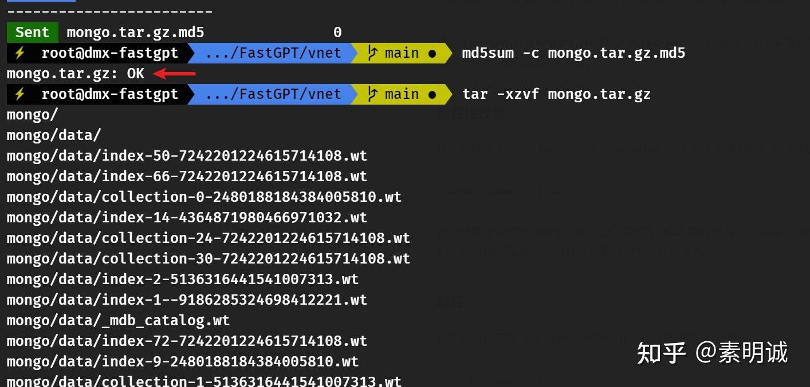

# Linux 使用 tar 命令进行迁移


 


以迁移 MongoDB 的数据为例。

停止当前机器上运行的 MongoDB 服务,以确保数据库文件处于一致状态。

## 打包  

本次迁移的是 mongo/ 的卷文件到另一台机器上

使用 `tar` 命令将 `mongo` 目录打包成一个归档文件。`tar` 命令可以保留文件权限和所有者信息。

```
tar -czvf mongo.tar.gz mongo/
```

这会将 `mongo` 目录打包成一个名为 `mongo.tar.gz` 的归档文件。

## 校验  

使用 `md5sum` 或 `sha256sum` 命令计算归档文件的校验和。例如:

```
md5sum mongo.tar.gz > mongo.tar.gz.md5
```

这会计算 `mongo.tar.gz` 文件的 MD5 校验和,并将其保存到 `mongo.tar.gz.md5` 文件中。

使用安全的文件传输工具将归档文件 `mongo.tar.gz` 和校验和文件 `mongo.tar.gz.md5` 传输到目标机器。例如,你可以使用 `scp` 或 `rsync` 等工具进行传输。

```
scp mongo.tar.gz mongo.tar.gz.md5 user@target_machine:/path/to/destination/
```

将 `user` 替换为目标机器的用户名,`target_machine` 替换为目标机器的主机名或IP,`/path/to/destination/` 替换为目标机器上的目标目录。

## 完整性校验  

在目标机器上,使用 `md5sum` 或 `sha256sum` 命令验证接收到的归档文件的完整性。

```
md5sum -c mongo.tar.gz.md5
```

这会计算接收到的 `mongo.tar.gz` 文件的 MD5 校验和,并与 `mongo.tar.gz.md5` 文件中的校验和进行比较。如果校验和匹配,则说明文件在传输过程中没有被修改。

## 解压  

如果校验和匹配,使用 `tar` 命令将归档文件解压缩到目标目录。

```
tar -xzvf mongo.tar.gz
```

这会将 `mongo.tar.gz` 文件解压缩,并将 `mongo` 目录及其内容提取到当前目录。

通过以上步骤,你可以确保 `mongo` 目录在传输过程中的完整性,并将其准确地复制到目标机器上。