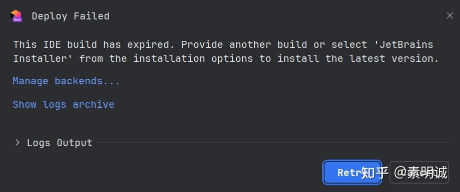
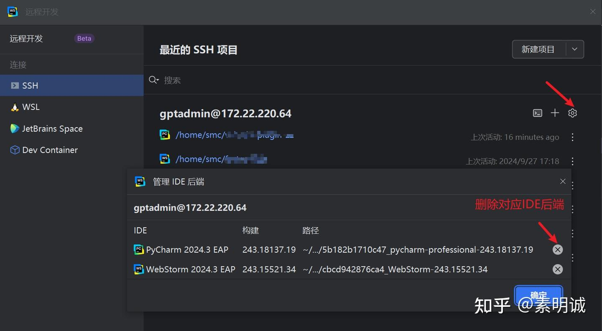

# 解决远程开发时 JetBrains IDE 版本已过期的问题

## 报错如下

## 解决步骤

### 更新 IDE 版本

根据提示选择“JetBrains Installer”，从安装选项中选择最新版本来安装。

打开你的 IDE，选择“Help” -> “Check for Updates”来获取最新版本并进行安装。

### 更新 IDE 版本依旧报错

重新填写远程主机的地址和密码，就可以恢复远程开发了
